# MDD

MDD (Markdown with Diagrams) は軽量な Markdown プリプロセッサ。

Markdown のコードブロックをスキャンし、外部プラグインを呼び出して、ブロックを生成された SVG 画像に置換する。

プラグインは `$PATH` から発見される単純な実行可能コマンド。

コードブロック:

````markdown
```sequence
Alice -> Bob: Hello
```
````

に対して MDD は以下を実行する:

```bash
mdd-sequence
```

ブロックの内容は標準入力で渡され、プラグインは標準出力で SVG を返す。

```text
Markdown
    ↓
コードブロック
    ↓
mdd-{ブロック名}
    ↓
SVG
    ↓
Markdown
```

MDD 本体が担うのは以下のみ:

* Markdown のパース
* プラグインの発見
* プラグインの実行
* Markdown の生成

図の描画ロジックはすべてプラグイン側に属する。

## インストール

### ワンライナー（推奨）

```sh
# macOS / Linux
curl -fsSL https://raw.githubusercontent.com/ppdx999/mdd/main/install.sh | sh
```

```powershell
# Windows (PowerShell)
iwr https://raw.githubusercontent.com/ppdx999/mdd/main/install.ps1 -useb | iex
```

`~/.local/bin/` にインストールされる。`MDD_INSTALL_DIR` 環境変数でインストール先を変更可能。

### ソースからビルド

Rust ツールチェインが必要。

```sh
git clone https://github.com/ppdx999/mdd.git
cd mdd
make install
```

`~/.cargo/bin/` に `mdd` と全プラグインがインストールされる。

アンインストール:

```sh
make uninstall
```

## 公式プラグイン

### ユースケース図 ([mdd-usecase](crates/mdd-usecase/))

アクター、ユースケース、パッケージで構成されるユースケース図。

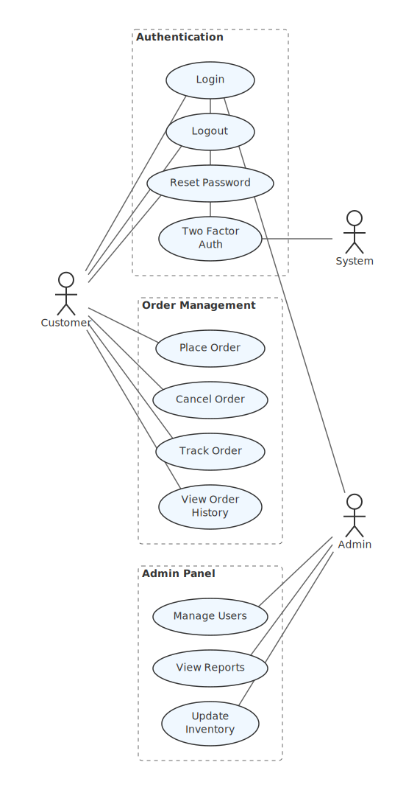

### DFD — データフロー図 ([mdd-dfd](crates/mdd-dfd/))

外部エンティティ、プロセス、データストア間のデータの流れを可視化する。データストアにはテーブル名と列名を記述可能。

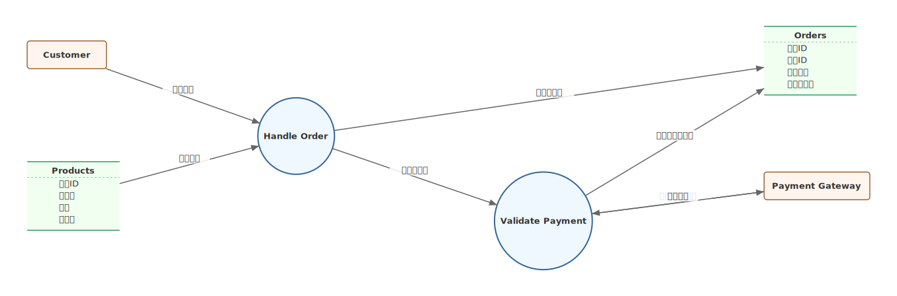

### ツリー図 ([mdd-tree](crates/mdd-tree/))

組織図、ディレクトリ構造、分類体系などの階層構造をトップダウンで描画する。グループで複数ノードをまとめられる。

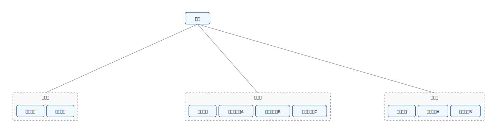

### ER 図 ([mdd-er](crates/mdd-er/))

テーブル定義（主キー、列名）とリレーション（1:1, 1:N, N:M）を描画する。

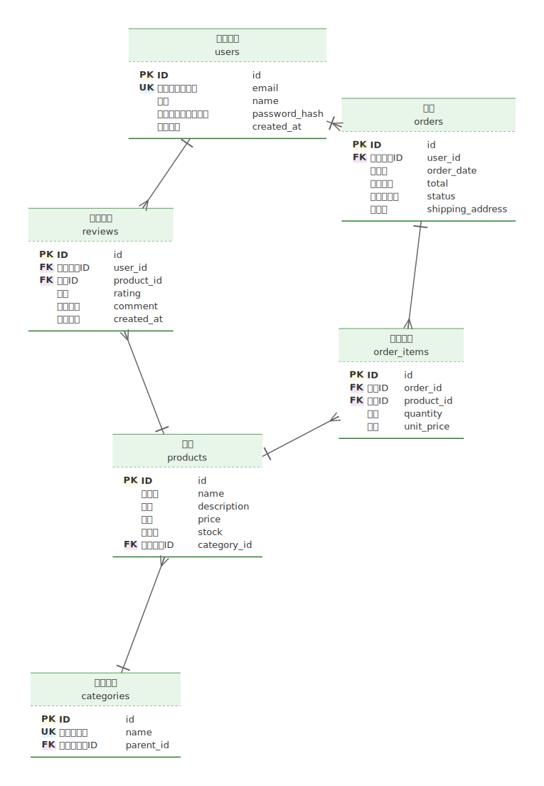

### シーケンス図 ([mdd-sequence](crates/mdd-sequence/))

参加者間のメッセージの時系列を描画する。同期メッセージ（実線）、応答メッセージ（破線）、自己メッセージに対応。

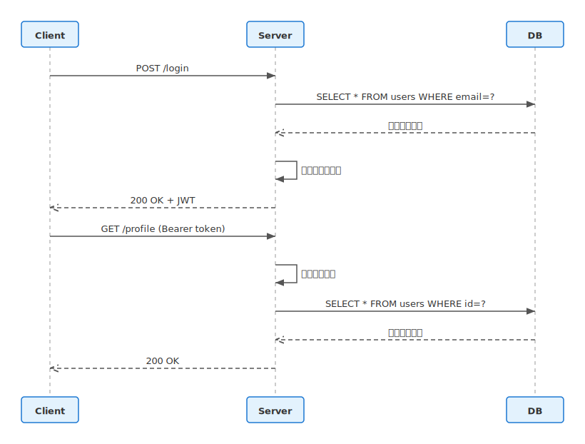

### 状態遷移図 ([mdd-state](crates/mdd-state/))

状態マシンの状態とラベル付き遷移を描画する。自己遷移にも対応。

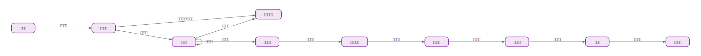

### インフラ構成図 ([mdd-infra](crates/mdd-infra/))

ネストしたグループ（AWS > VPC > サブネット）と種別付きコンポーネント（server, db, lb, cache, queue, storage, cdn 等）で構成されるインフラ構成図。

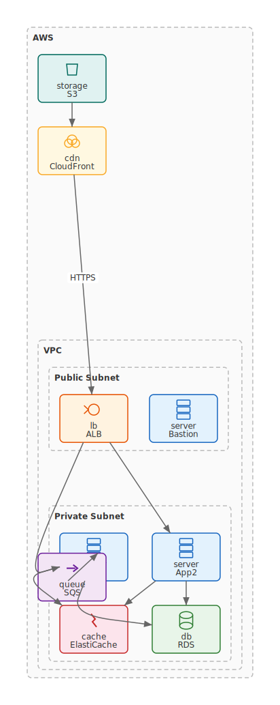

### ガントチャート ([mdd-gantt](crates/mdd-gantt/))

タスクの開始日・期間・依存関係を時系列で描画する。セクションによるグループ化に対応。

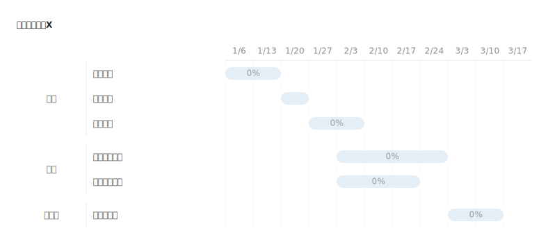

### フローチャート ([mdd-flowchart](crates/mdd-flowchart/))

開始/終了（楕円）、処理（矩形）、分岐（ひし形）で構成されるフローチャート。業務フローやアルゴリズムの可視化に。

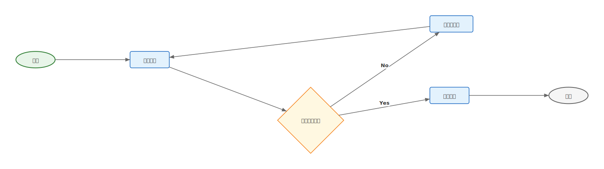

### スイムレーン図 ([mdd-swimlane](crates/mdd-swimlane/))

レーン（部門/担当者）ごとに分けたフローチャート。業務フローの責任分担を可視化する。

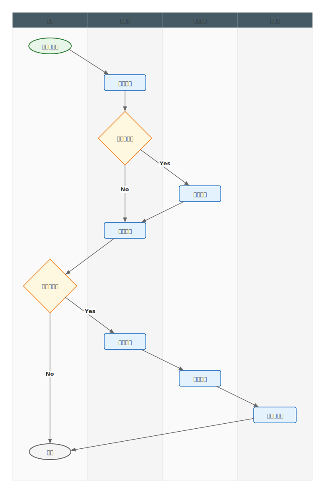

### グリッド図 ([mdd-grid](crates/mdd-grid/))

RACI マトリクス、機能×チーム対応表、権限表などを色付きグリッドで可視化する。

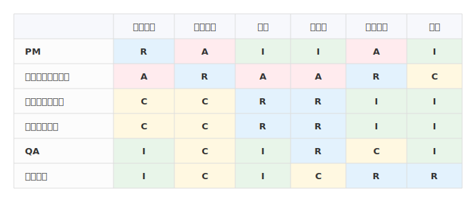

<<<<<<< HEAD
### 分析図 ([mdd-analysis](crates/mdd-analysis/))

構成比や内訳を積み上げバーチャートやウォーターフォールチャートで可視化する。

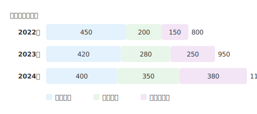

### ステップ図 ([mdd-steps](crates/mdd-steps/))

段階的な進行・成長を階段状に表現する。開発プロセスやスキル成長の可視化に。

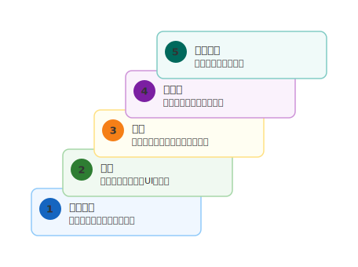

### ランキング図 ([mdd-ranking](crates/mdd-ranking/))

順位付きリストを横棒グラフで可視化する。売上ランキング、優先度順位などに。

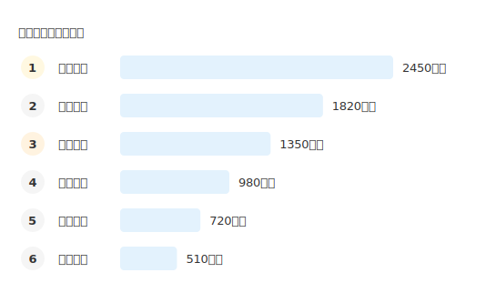

=======
>>>>>>> feat/mdd-group-multi
### グループ図 ([mdd-group-multi](crates/mdd-group-multi/))

多数のグループと要素をグリッド状に整理して配置する。部署一覧、技術スタック、カテゴリ分類などに。

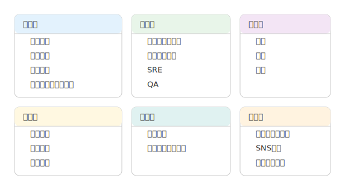

## ロードマップ

今後追加予定のプラグイン:

| プラグイン | 説明 | 用途 |
|---|---|---|
| mdd-dependency | 依存関係図 | パッケージ/モジュール/サービス間の依存を可視化。循環依存の発見に |
| mdd-context-map | コンテキストマップ | DDD のバウンデッドコンテキスト間の関係（upstream/downstream、共有カーネル、ACL 等） |
| mdd-timeline | タイムライン | プロジェクトのマイルストーン、リリース履歴、イベントの時系列可視化 |
| mdd-block | ブロック図 | シンプルな箱と矢印の汎用図。C4 モデルの Context/Container レベルの概要図に |

## AGENTS.md 向けサンプル

AI エージェントにドキュメント内で図を生成させる際、`AGENTS.md` に以下のような記述を追加すると効果的。

````markdown
## 図の生成

このプロジェクトでは [mdd](https://github.com/ppdx999/mdd) を使って Markdown 内に図を埋め込む。
コードブロックの言語名に応じたプラグインが SVG を生成する。

### ユースケース図

```usecase
actor Customer
actor Admin

package "認証" {
  usecase Login
  usecase Logout
}

Customer -> Login
Admin -> Login
Admin -> Logout
```

### DFD（データフロー図）

```dfd
entity Customer
entity PaymentGateway

process HandleOrder
process ValidatePayment

datastore Orders {
  注文ID
  顧客ID
  合計金額
  ステータス
}

Customer -> HandleOrder : "注文情報"
HandleOrder -> Orders : "注文データ"
HandleOrder -> ValidatePayment : "支払い依頼"
ValidatePayment -> PaymentGateway : "決済リクエスト"
```
````
