# MDD

MDD (Markdown with Diagrams) は軽量な Markdown プリプロセッサ。

Markdown のコードブロックをスキャンし、外部プラグインを呼び出して、ブロックを生成された SVG 画像に置換する。

プラグインは `$PATH` から発見される単純な実行可能コマンド。

コードブロック:

````markdown
```sequence
Alice -> Bob: Hello
```
````

に対して MDD は以下を実行する:

```bash
mdd-sequence
```

ブロックの内容は標準入力で渡され、プラグインは標準出力で SVG を返す。

```text
Markdown
    ↓
コードブロック
    ↓
mdd-{ブロック名}
    ↓
SVG
    ↓
Markdown
```

MDD 本体が担うのは以下のみ:

* Markdown のパース
* プラグインの発見
* プラグインの実行
* Markdown の生成

図の描画ロジックはすべてプラグイン側に属する。

## インストール

### ワンライナー（推奨）

```sh
# macOS / Linux
curl -fsSL https://raw.githubusercontent.com/ppdx999/mdd/main/install.sh | sh
```

```powershell
# Windows (PowerShell)
iwr https://raw.githubusercontent.com/ppdx999/mdd/main/install.ps1 -useb | iex
```

`~/.local/bin/` にインストールされる。`MDD_INSTALL_DIR` 環境変数でインストール先を変更可能。

### ソースからビルド

Rust ツールチェインが必要。

```sh
git clone https://github.com/ppdx999/mdd.git
cd mdd
make install
```

`~/.cargo/bin/` に `mdd` と全プラグインがインストールされる。

アンインストール:

```sh
make uninstall
```

## 公式プラグイン

### ユースケース図 ([mdd-usecase](crates/mdd-usecase/))

アクター、ユースケース、パッケージで構成されるユースケース図。


### DFD — データフロー図 ([mdd-dfd](crates/mdd-dfd/))

外部エンティティ、プロセス、データストア間のデータの流れを可視化する。データストアにはテーブル名と列名を記述可能。


### ツリー図 ([mdd-tree](crates/mdd-tree/))

組織図、ディレクトリ構造、分類体系などの階層構造をトップダウンで描画する。グループで複数ノードをまとめられる。


### ER 図 ([mdd-er](crates/mdd-er/))

テーブル定義（主キー、列名）とリレーション（1:1, 1:N, N:M）を描画する。


### シーケンス図 ([mdd-sequence](crates/mdd-sequence/))

参加者間のメッセージの時系列を描画する。同期メッセージ（実線）、応答メッセージ（破線）、自己メッセージに対応。


### 状態遷移図 ([mdd-state](crates/mdd-state/))

状態マシンの状態とラベル付き遷移を描画する。自己遷移にも対応。


### インフラ構成図 ([mdd-infra](crates/mdd-infra/))

ネストしたグループ（AWS > VPC > サブネット）と種別付きコンポーネント（server, db, lb, cache, queue, storage, cdn 等）で構成されるインフラ構成図。


### ガントチャート ([mdd-gantt](crates/mdd-gantt/))

タスクの開始日・期間・依存関係を時系列で描画する。セクションによるグループ化に対応。


### フローチャート ([mdd-flowchart](crates/mdd-flowchart/))

開始/終了（楕円）、処理（矩形）、分岐（ひし形）で構成されるフローチャート。業務フローやアルゴリズムの可視化に。


### スイムレーン図 ([mdd-swimlane](crates/mdd-swimlane/))

レーン（部門/担当者）ごとに分けたフローチャート。業務フローの責任分担を可視化する。


### グリッド図 ([mdd-grid](crates/mdd-grid/))

RACI マトリクス、機能×チーム対応表、権限表などを色付きグリッドで可視化する。


### 分析図 ([mdd-analysis](crates/mdd-analysis/))

構成比や内訳を積み上げバーチャートやウォーターフォールチャートで可視化する。


### ステップ図 ([mdd-steps](crates/mdd-steps/))

段階的な進行・成長を階段状に表現する。開発プロセスやスキル成長の可視化に。


### ランキング図 ([mdd-ranking](crates/mdd-ranking/))

順位付きリストを横棒グラフで可視化する。売上ランキング、優先度順位などに。


### グループ図 ([mdd-group-multi](crates/mdd-group-multi/))

多数のグループと要素をグリッド状に整理して配置する。部署一覧、技術スタック、カテゴリ分類などに。


### レイヤー図 ([mdd-layer](crates/mdd-layer/))

OSI参照モデル、アーキテクチャレイヤーなどの積層構造を可視化する。グループによるレイヤーのまとめ、右側への説明表示に対応。

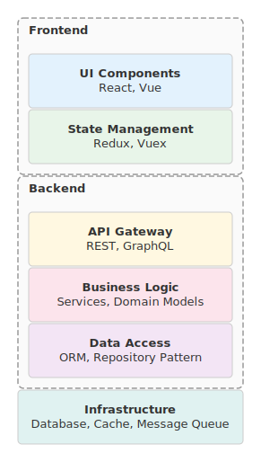

### タイムライン ([mdd-timeline](crates/mdd-timeline/))

プロジェクトのマイルストーン、会社沿革、リリース履歴などの時系列イベントを水平タイムラインで可視化する。

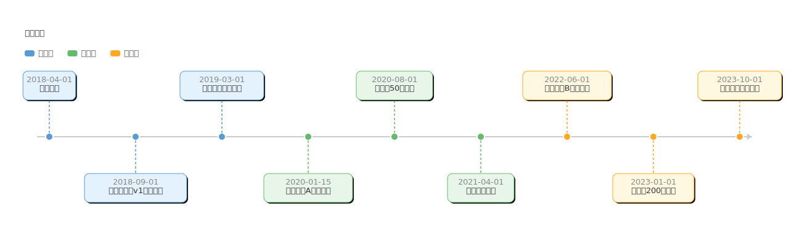

### ビフォーアフター図 ([mdd-before-after](crates/mdd-before-after/))

変更前後の状態を左右に並べて対比する。業務改善、システム移行などの提案資料に。

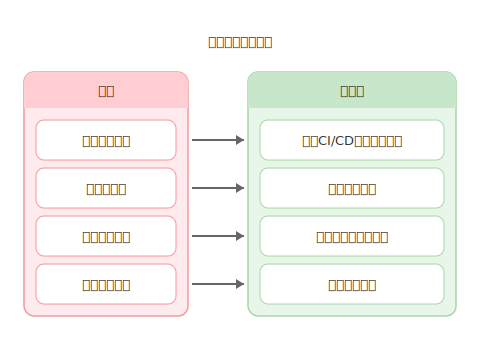

### サイクル図 ([mdd-cycle](crates/mdd-cycle/))

PDCA、DevOps、Scrum など循環するプロセスを円形に配置して可視化する。放射状の説明表示に対応。

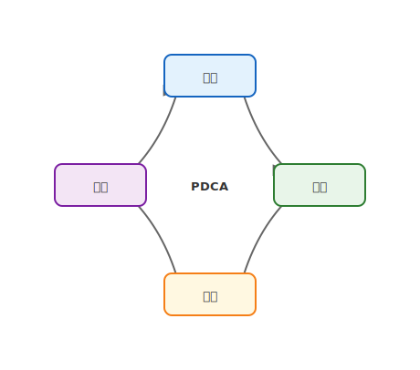

### プロセスフロー図 ([mdd-process](crates/mdd-process/))

横方向の矢印で繋いだプロセスフロー図。業務手順やワークフローの可視化に。カード下への説明表示に対応。

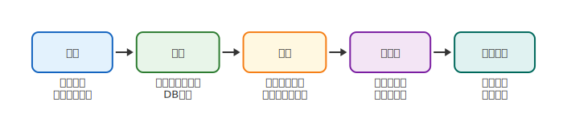

### ファネル図 ([mdd-funnel](crates/mdd-funnel/))

営業パイプライン、コンバージョン漏斗などのファネル図。値による幅の自動調整、右側への説明表示に対応。

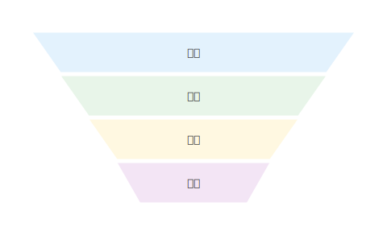

### ピラミッド図 ([mdd-pyramid](crates/mdd-pyramid/))

階層構造の概念図。マズローの欲求階層、戦略ピラミッドなどに。右側への説明表示に対応。

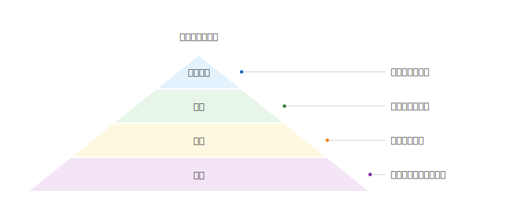

### トライアングル図 ([mdd-triangle](crates/mdd-triangle/))

3要素の三角関係を可視化する。QCD、スコープ・コスト・時間などに。

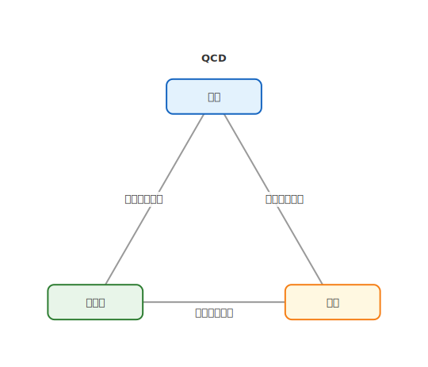

### マトリクス図 ([mdd-matrix](crates/mdd-matrix/))

2軸で分類する2x2マトリクス図。アイゼンハワー・マトリクス、リスク分析などに。

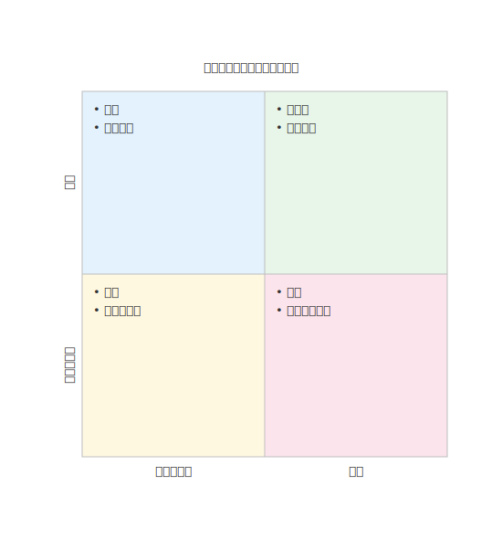

### 比較図 ([mdd-compare](crates/mdd-compare/))

2〜3案を並べて対比する。フレームワーク比較、料金プラン比較などに。

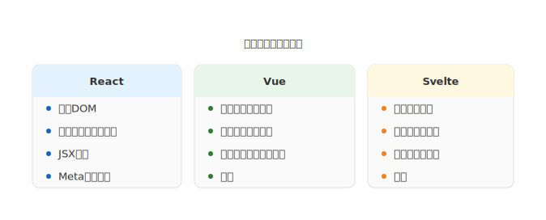

### 規模比較図 ([mdd-scale](crates/mdd-scale/))

数量や規模の大小を横棒グラフで視覚的に比較する。

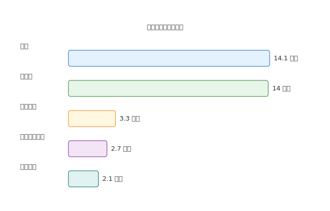

### SWOT分析図 ([mdd-swot](crates/mdd-swot/))

強み・弱み・機会・脅威の4象限で分析する SWOT 図。

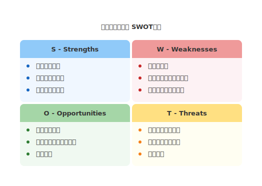

### ベン図 ([mdd-venn](crates/mdd-venn/))

集合の重なりを可視化する。2〜3セットに対応。

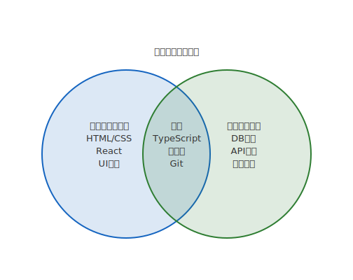

### 放射図 ([mdd-radial](crates/mdd-radial/))

中心概念と周辺要素の関係をハブ&スポーク型で表現する。

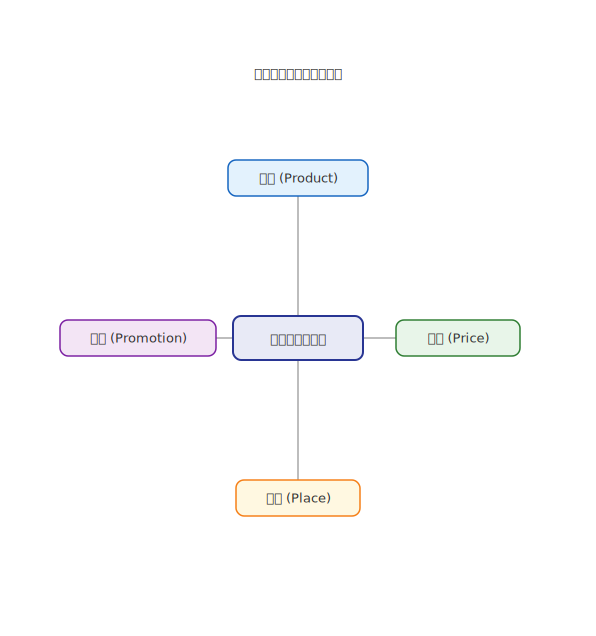

### 相関図・概念図 ([mdd-concept](crates/mdd-concept/))

概念間の自由な関係性を線と矢印で表現する。有向・無向リンクに対応。

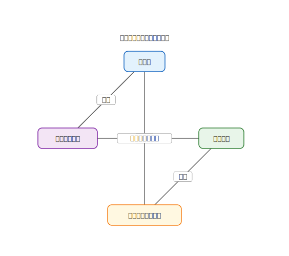

### マインドマップ ([mdd-mindmap](crates/mdd-mindmap/))

中心トピックから放射状に枝分かれするマインドマップ。ブレスト、アイデア整理に。

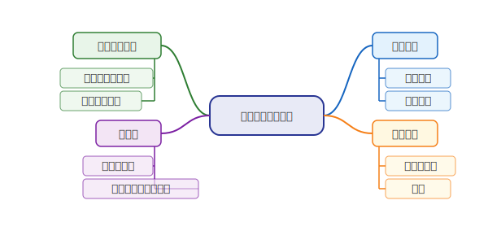

### パズル・ハニカム図 ([mdd-puzzle](crates/mdd-puzzle/))

六角形のハニカム構造で要素を配置する。チーム構成、構成要素の表現に。

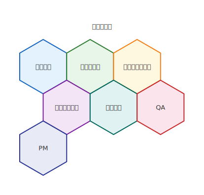

### グループ図 ([mdd-group](crates/mdd-group/))

2〜4グループの要素をカード形式で並べて表示する。


### テーブル ([mdd-table](crates/mdd-table/))

Markdown の表より視覚的にリッチな SVG テーブル。ヘッダー色分け、交互背景に対応。

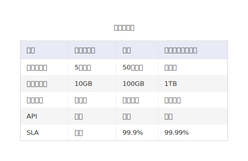

### 縦型リスト ([mdd-list-v](crates/mdd-list-v/))

番号バッジ付きの縦方向リスト。手順説明や設計原則の列挙に。


### 横型カードリスト ([mdd-list-h](crates/mdd-list-h/))

カード状の横方向リスト。企業バリュー、サービス一覧などに。

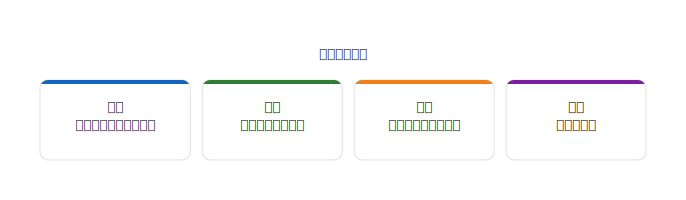

### グリッドリスト ([mdd-list-grid](crates/mdd-list-grid/))

グリッド配置の項目一覧。ツール一覧、チェックリストなどに。

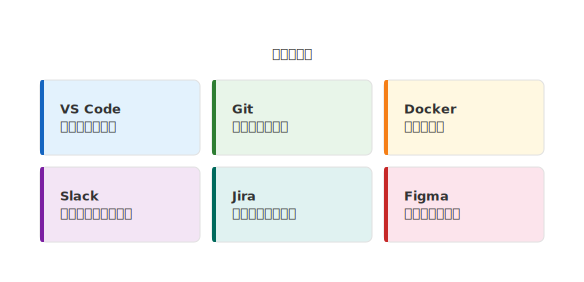

### KPI カード ([mdd-kpi](crates/mdd-kpi/))

数値ハイライトのメトリクスカード。ダッシュボード、KPI 表示に。


### 地図・マップ ([mdd-map](crates/mdd-map/))

拠点配置や地理的関係をピンとルートで簡易的に表現する。

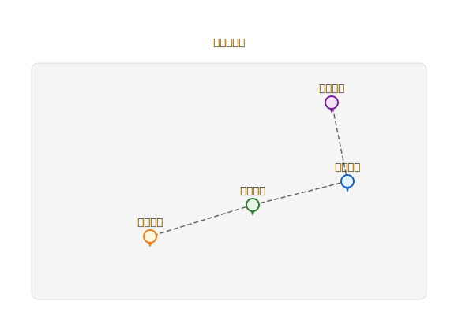

### 数式 ([mdd-math](crates/mdd-math/))

数式をセリフフォントで SVG レンダリングする。Unicode 数学記号に対応。

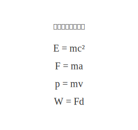

### TODO リスト ([mdd-todo](crates/mdd-todo/))

チェックボックス付きのタスクリスト。完了タスクは取り消し線で表示。説明の追加に対応。

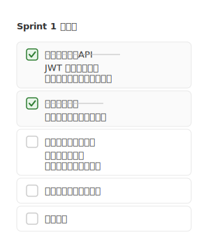

### ペルソナ・アクター図 ([mdd-persona](crates/mdd-persona/))

棒人間アクターとラベル、吹き出しでユーザーの声やステークホルダーの意見を可視化する。

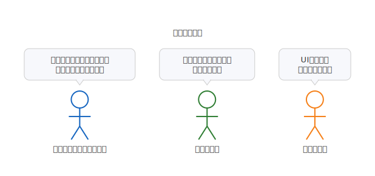

### ツイート風投稿 ([mdd-tweet](crates/mdd-tweet/))

Twitter/X 風のカード形式で投稿を表示。アバター、いいね、リツイート、日時に対応。

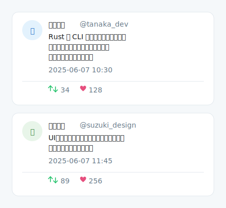

### Slack 風メッセージ ([mdd-slack](crates/mdd-slack/))

Slack のチャット画面風にメッセージを表示。チャンネル名、リアクション、スレッド返信数に対応。

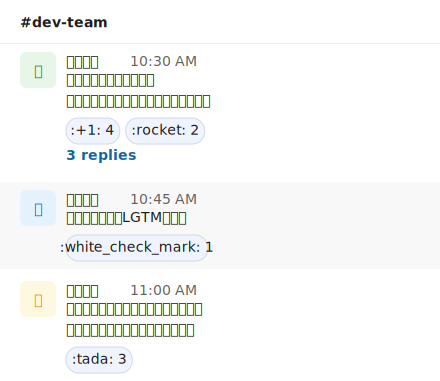

### カンバンボード ([mdd-kanban](crates/mdd-kanban/))

Todo/In Progress/Done などの列にカードを配置するカンバンボード。ラベル付きカードに対応。


### レーダーチャート ([mdd-radar](crates/mdd-radar/))

多軸のスキルや特性を比較するレーダー（スパイダー）チャート。複数データセットの重ね合わせに対応。


### 円グラフ ([mdd-pie](crates/mdd-pie/))

構成比や割合を可視化する円グラフ。凡例付き。

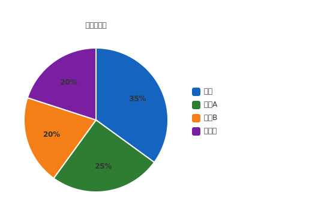

### ユーザージャーニーマップ ([mdd-journey](crates/mdd-journey/))

ステージ・行動・感情を時系列で可視化するジャーニーマップ。感情曲線と絵文字に対応。

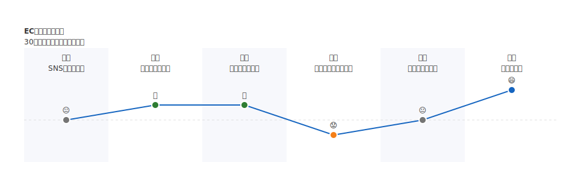

### ワイヤーフレーム ([mdd-wireframe](crates/mdd-wireframe/))

簡易的なUIモックアップ。ヘッダー、テキスト、ボタン、入力欄、画像プレースホルダーに対応。

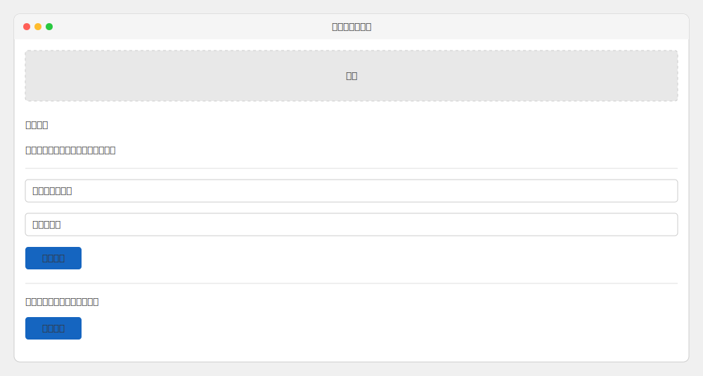

### リリースノート ([mdd-changelog](crates/mdd-changelog/))

バージョンごとの変更点をカード形式で表示。add/fix/change/remove/improve/security のタグ分類に対応。


### FAQ ([mdd-faq](crates/mdd-faq/))

Q&A 形式のよくある質問。Q/A バッジ付きのカードレイアウト。複数行回答に対応。

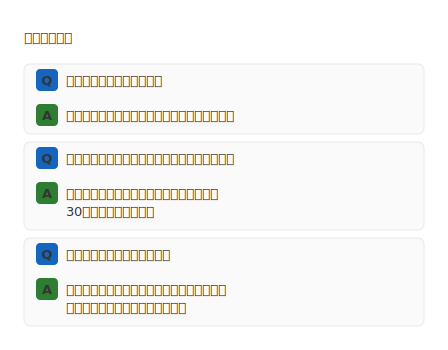

### 引用・テスティモニアル ([mdd-quote](crates/mdd-quote/))

顧客の声やレビューをカード形式で表示。著者・役職・カラーアクセント付き。


### 料金表 ([mdd-pricetable](crates/mdd-pricetable/))

プラン比較の料金表。ハイライト（おすすめ）プランの強調に対応。

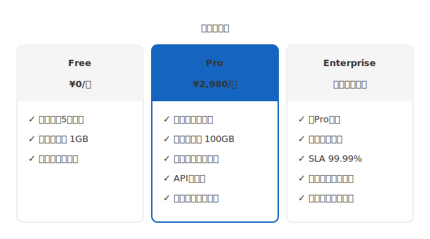

### 組織図 ([mdd-org](crates/mdd-org/))

メンバーと上下関係を階層的に可視化する組織図。役職ラベルに対応。

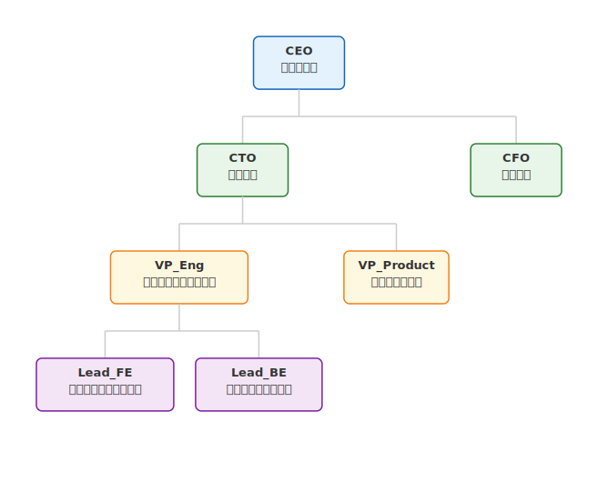

### Git ブランチ図 ([mdd-gitgraph](crates/mdd-gitgraph/))

Git のブランチ、コミット、マージ、タグを可視化する。フィーチャーブランチ戦略の説明などに。

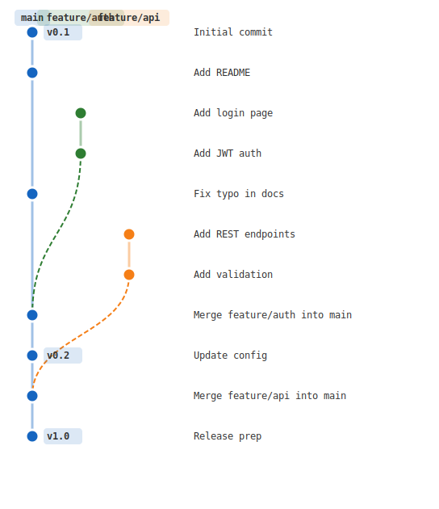

## AGENTS.md 向けサンプル

AI エージェントにドキュメント内で図を生成させる際、`AGENTS.md` に以下のような記述を追加すると効果的。

````markdown
## 図の生成

このプロジェクトでは [mdd](https://github.com/ppdx999/mdd) を使って Markdown 内に図を埋め込む。
コードブロックの言語名に応じたプラグインが SVG を生成する。

### ユースケース図

```usecase
actor Customer
actor Admin

package "認証" {
  usecase Login
  usecase Logout
}

Customer -> Login
Admin -> Login
Admin -> Logout
```

### DFD（データフロー図）

```dfd
entity Customer
entity PaymentGateway

process HandleOrder
process ValidatePayment

datastore Orders {
  注文ID
  顧客ID
  合計金額
  ステータス
}

Customer -> HandleOrder : "注文情報"
HandleOrder -> Orders : "注文データ"
HandleOrder -> ValidatePayment : "支払い依頼"
ValidatePayment -> PaymentGateway : "決済リクエスト"
```

### ツリー図

```tree
node CEO
node CTO
node CFO

CEO -> CTO
CEO -> CFO
```

### ER 図

```er
table Users {
  * id
  name
  email
}

table Posts {
  * id
  user_id
  title
  body
}

Users 1--* Posts
```

### シーケンス図

```sequence
Alice -> Bob : "Hello"
Bob --> Alice : "Hi there"
```

### 状態遷移図

```state
state 待機中
state 処理中
state 完了

待機中 -> 処理中 : "開始"
処理中 -> 完了 : "成功"
```

### インフラ構成図

```infra
node Client type=user
node WebServer type=server
node Database type=db

Client -> WebServer : "HTTP"
WebServer -> Database : "SQL"
```

### ガントチャート

```gantt
title スプリント1
unit day

タスクA : 2025-01-06, 3d
タスクB : 2025-01-06, 5d
タスクC : after タスクA, 4d
```

### フローチャート

```flowchart
start 開始
process 処理
end 終了

開始 -> 処理
処理 -> 終了
```

### スイムレーン図

```swimlane
lane 顧客
lane 営業部

顧客: start 問い合わせ
営業部: process 受付対応
営業部: end 回答

問い合わせ -> 受付対応
受付対応 -> 回答
```

### グリッド図

```grid
columns 認証, 注文, 決済

color ○ : blue, #e3f2fd
color △ : amber, #fff8e1
color - : lightgrey, #fafafa

チームA : ○, ○, -
チームB : -, -, ○
```

### 分析図

```analysis
type stacked-bar

bar Q1 : 製品A 300, 製品B 200
bar Q2 : 製品A 350, 製品B 180
```

### ステップ図

```steps
step 計画
step 実行
step 評価
```

### ランキング図

```ranking
商品A : 1500
商品B : 1200
商品C : 900
```

### グループ図（多数要素）

```group-multi
group "Frontend" {
- React
- TypeScript
}

group "Backend" {
- Rust
- PostgreSQL
}
```

### レイヤー図

```layer
layer プレゼンテーション層
layer ビジネスロジック層 : "サービス、ドメインモデル"
layer データアクセス層
```

### タイムライン

```timeline
2025-01-15 : 企画開始
2025-03-01 : 開発着手
2025-06-01 : リリース
```

### ビフォーアフター図

```before-after
before "Before" {
  Manual deploy
  No tests
}

after "After" {
  Auto CI/CD
  Full test coverage
}
```

### サイクル図

```cycle
step 計画 : "目標設定"
step 実行 : "計画に基づき実施"
step 評価 : "結果の測定"
step 改善 : "改善策の立案"
```

### プロセスフロー図

```process
step 企画 : "要件定義"
step 設計
step 実装
step テスト
step リリース
```

### ファネル図

```funnel
title "営業ファネル"
stage リード獲得 : 1000
stage 商談化 : 400
stage 受注 : 40
```

### ピラミッド図

```pyramid
level ビジョン : "企業の存在意義"
level 戦略 : "長期的な方向性"
level 実行 : "日々のオペレーション"
```

### トライアングル図

```triangle
title "QCD"
node 品質
node コスト
node 納期
edge 0 -- 1 : "トレードオフ"
edge 1 -- 2 : "トレードオフ"
edge 0 -- 2 : "トレードオフ"
```

### マトリクス図

```matrix
title "リスクマトリクス"
x-axis "影響度：小" "影響度：大"
y-axis "発生確率：低" "発生確率：高"
quadrant 1 : "監視"
quadrant 2 : "対策必須"
quadrant 3 : "許容"
quadrant 4 : "軽減策検討"
```

### 比較図

```compare
title "プラン比較"
option "ベーシック" {
  月額980円
  ストレージ 10GB
}
option "プロ" {
  月額2,980円
  ストレージ 100GB
  API利用可
}
```

### 規模比較図

```scale
title "ストレージ容量"
unit "TB"
item 本番DB : 500
item バックアップ : 300
item ログ : 150
```

### SWOT 分析図

```swot
strengths {
  高い品質
  低価格
}
weaknesses {
  機能が少ない
}
opportunities {
  新興国市場
}
threats {
  競合の新製品
}
```

### ベン図

```venn
set "フロントエンド" {
  React
  UI設計
}
set "バックエンド" {
  DB設計
  API設計
}
overlap "共通" {
  TypeScript
  Git
}
```

### 放射図

```radial
center "マーケティング"
spoke 製品 (Product)
spoke 価格 (Price)
spoke 流通 (Place)
spoke 販促 (Promotion)
```

### 相関図・概念図

```concept
node 設計
node 実装
node テスト
link 設計 -> 実装 : "仕様"
link 実装 -> テスト : "成果物"
link テスト -> 設計 : "改善要求"
```

### マインドマップ

```mindmap
center "プロジェクト計画"
  スコープ
    機能一覧
    優先順位
  スケジュール
    マイルストーン
  リソース
    チーム構成
    予算
```

### パズル・ハニカム図

```puzzle
piece 戦略
piece 人材
piece 技術
piece プロセス
```

### グループ図

```group
group "フロントエンド" {
  React
  TypeScript
}
group "バックエンド" {
  Rust
  PostgreSQL
}
```

### テーブル

```table
title "開発スケジュール"
| フェーズ | 期間 | 担当 |
| 要件定義 | 2週間 | PM |
| 設計 | 3週間 | Tech Lead |
| 実装 | 6週間 | 開発チーム |
```

### 縦型リスト

```list-v
title "導入手順"
item "アカウント作成" : "メールアドレスで登録"
item "初期設定" : "プロフィール設定"
item "運用開始"
```

### 横型カードリスト

```list-h
title "サービス一覧"
card "コンサルティング" : "戦略立案から実行支援"
card "開発" : "Webアプリ開発"
card "運用" : "24/7監視・保守"
```

### グリッドリスト

```list-grid
title "チェックリスト"
columns 2
item "コードレビュー完了"
item "テスト全件パス"
item "ドキュメント更新"
item "ステージング検証"
```

### KPI カード

```kpi
title "サーバー状況"
metric "稼働率" : "99.97%"
metric "応答時間" : "142ms"
metric "エラー率" : "0.02%"
```

### 地図・マップ

```map
title "サーバー配置"
pin "US-East" at 150,150
pin "EU-West" at 300,100
pin "AP-Tokyo" at 450,160
route 0 -- 1
route 1 -- 2
```

### 数式

```math
E = mc²
F = ma
```

### TODO リスト

```todo
title "Sprint 1"
[x] ユーザー認証
[x] ログイン画面
[ ] パスワードリセット : "メール送信機能"
[ ] 管理画面
```

### ペルソナ・アクター図

```persona
actor Customer : "使いやすくしてほしい"
actor Developer : "技術的負債を解消したい"
actor Manager : "コストを抑えたい"
```

### ツイート風投稿

```tweet
post "Alice" @alice : "Hello world!"
likes 42
retweets 10
time "2025-06-07 10:30"
```

### Slack 風メッセージ

```slack
channel #general
msg "Alice" : "Hello team!"
time "10:30 AM"
react :+1: 3
thread 5
```

### カンバンボード

```kanban
column Todo
card 機能A : "feature"
column In Progress
card バグ修正 : "bug"
column Done
card 初期設定 : "infra"
```

### レーダーチャート

```radar
axis フロントエンド
axis バックエンド
axis インフラ
data "田中" : 90, 70, 50
data "鈴木" : 60, 90, 80
```

### 円グラフ

```pie
title "市場シェア"
slice 自社 : 35
slice 競合A : 25
slice その他 : 20
```

### ユーザージャーニーマップ

```journey
stage 認知 : "広告を見る" : 3
stage 検索 : "商品を探す" : 4
stage 購入 : "決済する" : 2
stage 利用 : "商品を使う" : 5
```

### ワイヤーフレーム

```wireframe
title "ログイン"
header ログイン
input "メールアドレス"
input "パスワード"
button ログイン
```

### リリースノート

```changelog
release v2.0 : "2025-06-01"
- add 新機能
- fix バグ修正
- security 脆弱性対応
```

### FAQ

```faq
q "無料プランはありますか？"
a "はい、基本機能は無料です。"

q "解約はいつでもできますか？"
a "管理画面からいつでも解約可能です。"
```

### 引用・テスティモニアル

```quote
quote "導入して効率が3倍になりました。"
author "田中太郎"
role "CTO"
```

### 料金表

```pricetable
plan Free : "¥0/月"
- 基本機能
plan* Pro : "¥2,980/月"
- 全機能
- API利用可
```

### 組織図

```org
member CEO : "代表"
member CTO : "技術"
member CFO : "財務"
CEO -> CTO
CEO -> CFO
```

### Git ブランチ図

```gitgraph
commit "Initial commit"
branch feature
checkout feature
commit "Add feature"
checkout main
merge feature
commit "Release" tag "v1.0"
```
````
