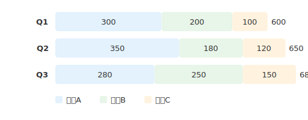
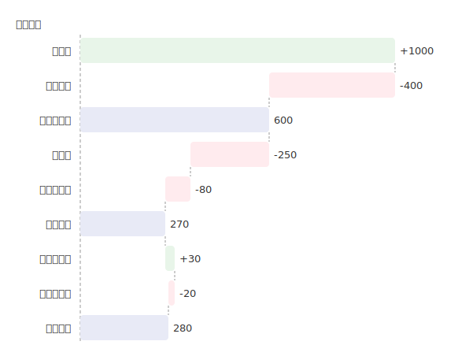
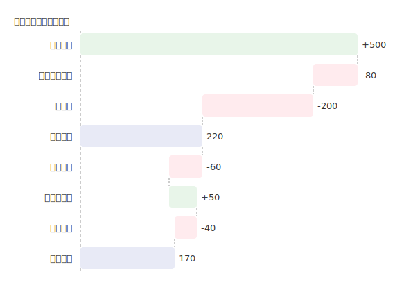

# mdd-analysis

`mdd` 用の分析図プラグイン。テキストベースの記法から SVG の分析図（積み上げバー、ウォーターフォール）を生成する。

## 使い方

```bash
# 直接実行
cat input.analysis | mdd-analysis > output.svg

# mdd 経由
mdd input.md > output.md
```

## 記法

### チャートタイプ

最初に `type` でチャートの種類を宣言する。

```
type stacked-bar    # 積み上げバーチャート
type waterfall      # ウォーターフォールチャート
```

### タイトル（任意）

```
title "売上分析"
```

### 色定義（任意）

```
color <名前> : <テキスト色>, <背景色>
```

色名には `red`, `blue`, `green`, `amber`, `orange`, `teal`, `purple`, `pink`, `grey` またはHEXコードが使える。

### 積み上げバー (`stacked-bar`)

```
bar <ラベル> : <セグメント名> <値>, <セグメント名> <値>, ...
```

### ウォーターフォール (`waterfall`)

```
item <ラベル> : <値>        # 正の値は増加、負の値は減少
subtotal <ラベル>            # その時点の累計を自動計算
```

ウォーターフォールでは以下の特殊な色名が使える:

- `positive` — 増加項目の色
- `negative` — 減少項目の色
- `subtotal` — 小計の色

## 描画

| 要素 | 背景色 | テキスト色 |
|---|---|---|
| 積み上げバーセグメント | パレットから自動割当 | パレットから自動割当 |
| ウォーターフォール（増加） | `#e8f5e9`（薄い緑） | `#2e7d32` |
| ウォーターフォール（減少） | `#ffebee`（薄い赤） | `#c62828` |
| ウォーターフォール（小計） | `#e8eaf6`（薄いインディゴ） | `#333` |

## サンプル

### 積み上げバー



### 売上構成（色指定あり）


### 損益計算（ウォーターフォール）



### 予算消化（ウォーターフォール）


