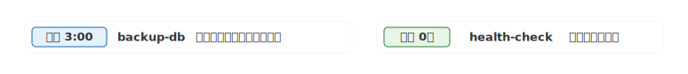
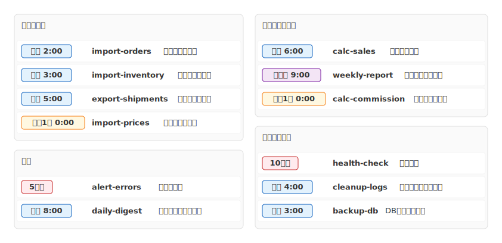

# mdd-batch

`mdd` 用のバッチジョブ一覧プラグイン。cron式からバッジ付きのジョブリファレンスを SVG で生成する。

## 使い方

```bash
# 直接実行
echo '0 3 * * * backup-db : "DBバックアップ"' | mdd-batch > out.svg

# mdd 経由
mdd input.md > output.md
```

## 記法

### ジョブ定義

cron式（5フィールド）+ ジョブ名 + 説明（任意）:

```
0 3 * * *    backup-db       : "毎日3時にDBバックアップ"
*/10 * * * *  health-check   : "10分毎のヘルスチェック"
0 0 * * 0    weekly-report   : "毎週日曜の週次レポート"
0 0 1 * *    monthly-calc    : "月次集計"
```

cron式は自動的に日本語に変換されてバッジに表示される:

| cron式 | 表示 |
|---|---|
| `0 3 * * *` | 毎日 3:00 |
| `0 * * * *` | 毎時 0分 |
| `*/10 * * * *` | 10分毎 |
| `0 9 * * 1` | 毎週月 9:00 |
| `0 0 1 * *` | 毎月1日 0:00 |

### グループ

```
group "カテゴリ名" {
  0 3 * * *  job-a : "説明"
  0 * * * *  job-b : "説明"
}
```

## サンプル

### 最小例



### システムバッチ


