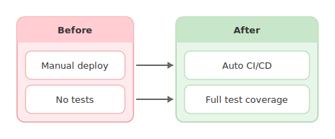
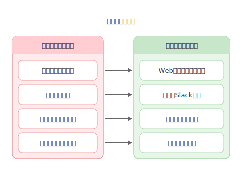

# mdd-before-after

`mdd` 用のビフォーアフター図プラグイン。テキストベースの記法から SVG のビフォーアフター図を生成する。

## 使い方

```bash
# 直接実行
cat input.before-after | mdd-before-after > output.svg

# mdd 経由
mdd input.md > output.md
```

## 記法

### タイトル（省略可）

```
title "システム改善計画"
```

### Before セクション

```
before "現状" {
  手動デプロイ
  テストなし
}
```

### After セクション

```
after "改善後" {
  自動CI/CD
  テスト自動化
}
```

セクション内の各行が 1 つの項目になる。Before と After の対応する項目が矢印で結ばれる。

## 描画

| 要素 | 形状 | 背景色 | テキスト色 |
|---|---|---|---|
| Before セクション | 角丸矩形 | `#ffebee`（薄い赤） | `#333` |
| Before ヘッダー | — | `#ffcdd2` | `#333` |
| After セクション | 角丸矩形 | `#e8f5e9`（薄い緑） | `#333` |
| After ヘッダー | — | `#c8e6c9` | `#333` |
| 項目 | 角丸矩形 | `#fff` | `#333` |
| 矢印 | 実線 + 三角 | — | `#666` |

## サンプル

### シンプル



### システム改善


### 承認フロー改善


