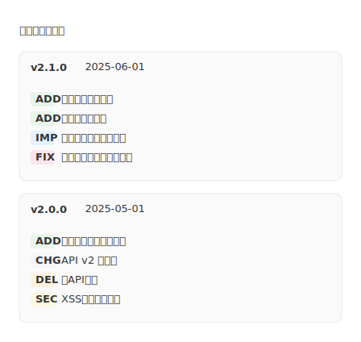

# mdd-changelog

リリースノートプラグイン。バージョンごとの変更点をカード形式で表示する。

## 使い方

```
cat input.changelog | mdd-changelog > output.svg
```

## 入力形式

```
title "リリースノート"
release v2.0 : "2025-06-01"
- add 新機能
- fix バグ修正
- change 仕様変更
- remove 機能廃止
- improve 改善
- security セキュリティ修正
```

## サンプル


