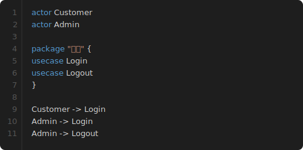

# mdd-code

コードブロック表示プラグイン。ダークエディタ風のシンタックスハイライト付きコードブロックを SVG で描画する。

## 使い方

```
cat input.code | mdd-code > output.svg
```

## 入力形式

```
title "ファイル名"
lang usecase
---
actor Customer
actor Admin
Customer -> Login
```

`title` と `lang` は省略可能。`---` 以降がコード本文。メタデータがない場合は全行がコードとして扱われる。

## 特徴

- ダークテーマ（エディタ風）
- 行番号表示
- シンタックスハイライト（キーワード青、文字列オレンジ、コメント緑）
- macOS 風のタイトルバー

## サンプル


