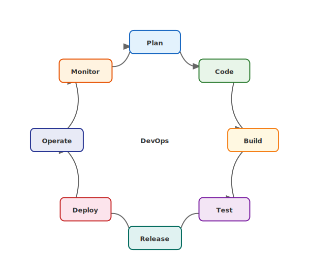
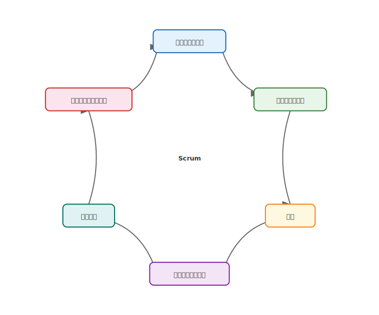

# mdd-cycle

`mdd` 用のサイクル図プラグイン。テキストベースの記法から SVG のサイクル図を生成する。

## 使い方

```bash
# 直接実行
cat input.cycle | mdd-cycle > output.svg

# mdd 経由
mdd input.md > output.md
```

## 記法

### ステップ定義

```
計画
実行
評価
改善
```

定義された順番に円形に配置され、最後のステップから最初のステップへ矢印が戻る。最低2つのステップが必要。

### 説明付き

各ステップに説明を追加できます。説明はノードの外側に表示されます。

```
計画 { 目標設定 }
実行 { 計画に基づき実施 }
```

説明は複数行にも対応しています。`{` から `}` までが説明になります。

```
計画 {
  目標設定
  行動計画策定
}
実行 { 計画に基づき実施 }
```

## 描画

| 要素 | 形状 | 背景色 | テキスト色 |
|---|---|---|---|
| ステップ | 角丸矩形 | ステップごとに異なるパステルカラー | `#333` |
| 矢印 | 曲線矢印 | — | `#666` |

## サンプル

### PDCA サイクル


### DevOps サイクル



### Scrum サイクル


