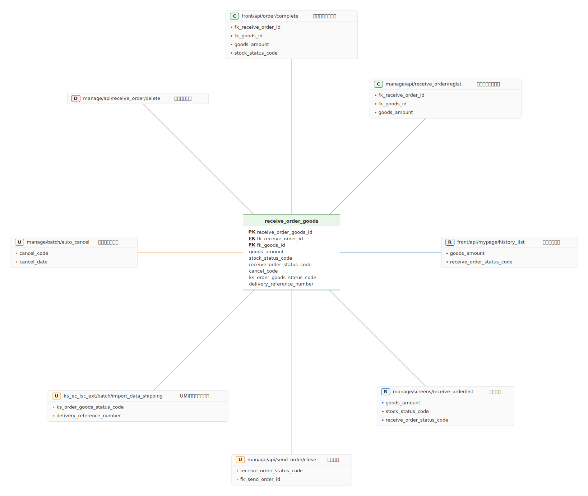

# mdd-data-lifecycle

`mdd` 用のデータライフサイクル図プラグイン。テーブルのカラムがどの操作（CRUD）でどう変更されるかを放射状に可視化する。

## 使い方

```bash
cat input.data-lifecycle | mdd-data-lifecycle > out.svg
```

## 記法

```
table テーブル名 {
  column_name : TYPE PK
  column_name : TYPE FK
}

create path : "説明" {
  affected_column
}

read path : "説明" {
  affected_column
}

update path : "説明" {
  affected_column
}

delete path : "説明"
```

## サンプル


