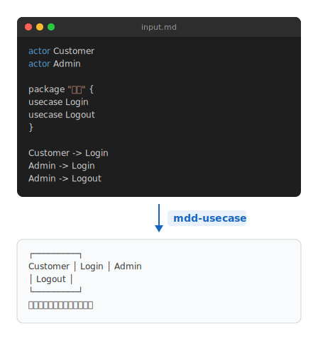

# mdd-demo

コード→図変換のデモ表示プラグイン。上にコードブロック（ダークエディタ風）、矢印、下に出力結果を縦に並べて表示する。

## 使い方

```
cat input.demo | mdd-demo > output.svg
```

## 入力形式

`arrow` 行の上がコード（入力）、下が出力。

```
actor Customer
actor Admin
Customer -> Login
arrow "mdd-usecase"
ユースケース図が生成される
```

`---` でも区切り可能。`arrow` を省略するとラベルは `mdd` になる。

## サンプル


