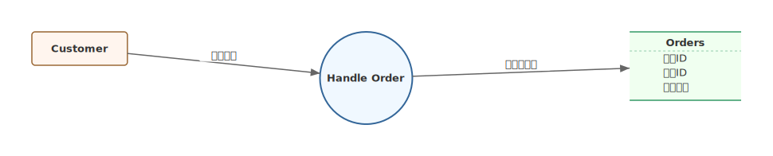
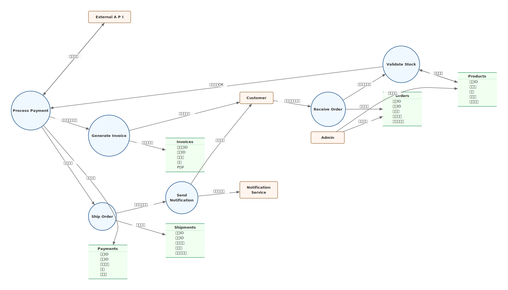
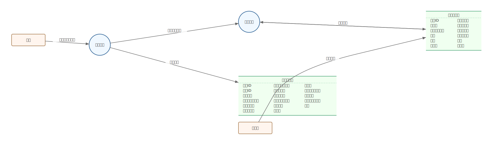

# mdd-dfd

`mdd` 用の DFD（Data Flow Diagram）プラグイン。テキストベースの記法から SVG の DFD を生成する。

## 使い方

標準入力から DFD 記法を受け取り、標準出力に SVG を出力する。

```sh
mdd-dfd < examples/simple.dfd > output.svg
```

`mdd` 経由で使う場合は、Markdown のコードブロックに `dfd` を指定する。

````md
```dfd
entity Customer
process HandleOrder
Customer -> HandleOrder : "注文情報"
```
````

## 記法

### entity

外部エンティティ（矩形）を定義する。

```
entity Customer
```

### process

プロセス（円）を定義する。

```
process HandleOrder
```

### datastore

データストアを定義する。テーブル名と列の論理名を指定できる。

```
datastore Orders {
  注文ID
  顧客ID
  合計金額
  ステータス
}
```

列なしのデータストアも定義可能。

```
datastore TempData
```

### flow (edge)

要素間のデータフロー（有向エッジ）を `->` で定義する。`: "ラベル"` でフローにラベルを付けられる。

```
Customer -> HandleOrder : "注文情報"
HandleOrder -> Orders : "注文データ"
HandleOrder -> ValidatePayment
```

## 描画

| 要素 | 形状 | 色 |
|---|---|---|
| entity | 角丸矩形 | 薄いオレンジ |
| process | 円 | 薄い青 |
| datastore | 2本の水平線 + テーブル名 + 列名 | 薄い緑 |
| flow | 矢印付き線 + ラベル | グレー |

レイアウトは mdd-usecase と同様に、図の複雑度に応じた適応的スペーシングと nodesep/ranksep 分離、row-based パッキングを適用する。

## サンプル

### シンプルな図



### 中規模の図


### 大規模な図



### 列数の多いデータストア


