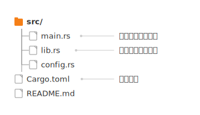
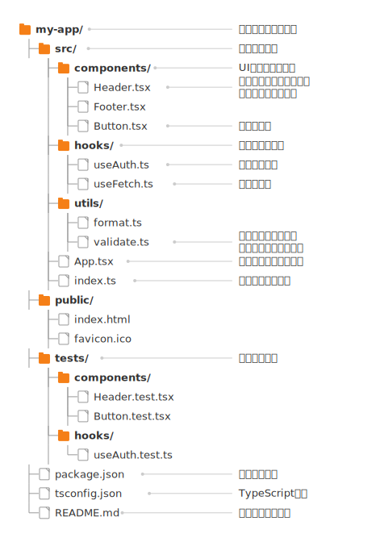

# mdd-dirtree

ディレクトリツリープラグイン。`tree` コマンド風のディレクトリ構造を SVG で描画する。各エントリにオプションの解説を付けられる。

## 使い方

```
cat input.dirtree | mdd-dirtree > output.svg
```

## 入力形式

インデント（2スペース）で階層を表現する。`/` で終わるエントリはディレクトリ。

```
src/
  main.rs
  lib.rs
Cargo.toml
README.md
```

### 解説付き

各エントリに ` : "説明"` で解説を追加できる。右側に線で接続して表示される。

```
src/ : "ソースコード"
  main.rs : "エントリポイント"
  lib.rs : "ライブラリルート"
```

複数行の解説にも対応。

```
src/ : "ソースコード
全体の構成"
  main.rs
```

## サンプル

### シンプル



### プロジェクト構成


