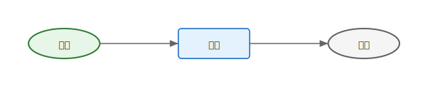
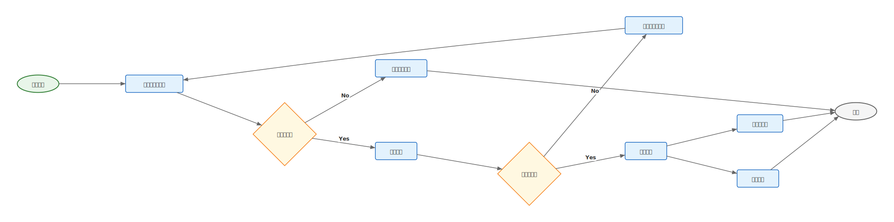

# mdd-flowchart

`mdd` 用のフローチャートプラグイン。テキストベースの記法から SVG のフローチャートを生成する。

## 使い方

標準入力からフローチャート記法を受け取り、標準出力に SVG を出力する。

```sh
mdd-flowchart < examples/simple.flowchart > output.svg
```

`mdd` 経由で使う場合は、Markdown のコードブロックに `flowchart` を指定する。

````md
```flowchart
start 開始
process 処理
decision 条件？
end 完了

開始 -> 処理
処理 -> 条件？
条件？ -> 完了 : "Yes"
```
````

## 記法

### start / end

開始・終了ノード（角丸楕円）。

```
start 開始
end 完了
```

### process

処理ノード（矩形）。

```
process データ処理
```

### decision

分岐ノード（ひし形）。

```
decision 条件を満たす？
```

### edge

ノード間のフロー（有向エッジ）。`: "ラベル"` でラベルを付けられる。

```
条件を満たす？ -> 処理A : "Yes"
条件を満たす？ -> 処理B : "No"
```

## 描画

| 要素 | 形状 | 色 |
|---|---|---|
| start | 角丸楕円 | 薄い緑 |
| end | 角丸楕円 | 薄いグレー |
| process | 矩形 | 薄い青 |
| decision | ひし形 | 薄い黄 |
| edge | 矢印付き線 + ラベル | グレー |

## サンプル

### シンプルなフロー



### 入力バリデーション


### 注文処理フロー


