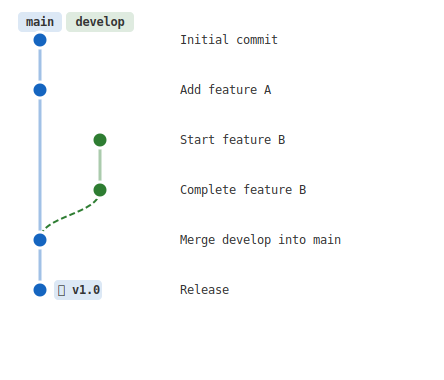

# mdd-gitgraph

Git ブランチ図プラグイン。ブランチ、コミット、マージ、タグを可視化する。

## 使い方

```
cat input.gitgraph | mdd-gitgraph > output.svg
```

## 入力形式

```
commit "Initial commit"
commit "Add feature" tag "v1.0"
branch feature
checkout feature
commit "Feature work"
checkout main
merge feature
```

### コマンド

| コマンド | 説明 |
|---------|------|
| `commit "message"` | 現在のブランチにコミットを追加 |
| `commit "message" tag "tag"` | タグ付きコミット |
| `branch name` | 新しいブランチを作成 |
| `checkout name` | ブランチを切り替え |
| `merge name` | 指定ブランチを現在のブランチにマージ |

## サンプル

### シンプル



### フィーチャーブランチ


