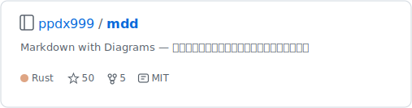

# mdd-github

GitHub リポジトリカードプラグイン。GitHub のリポジトリリンクプレビュー風のカードを SVG で描画する。

## 使い方

```
cat input.github | mdd-github > output.svg
```

## 入力形式

```
repo owner/name
desc "説明文"
lang Rust
stars 100
forks 20
license MIT
```

`desc`、`lang`、`stars`、`forks`、`license` はすべて省略可能。

## サンプル


