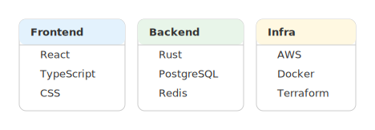
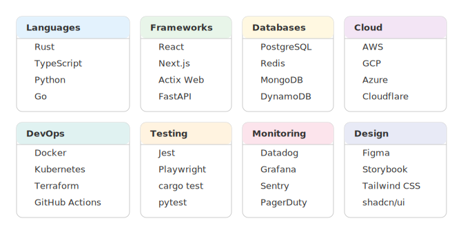

# mdd-group-multi

`mdd` 用のグループ図（多数要素）プラグイン。テキストベースの記法から SVG のグループ図を生成する。

## 使い方

```bash
cat input.group-multi | mdd-group-multi > output.svg
```

mdd 経由:

````markdown
```group-multi
group "Frontend" {
- React
- TypeScript
}

group "Backend" {
- Rust
- PostgreSQL
}
```
````

## 記法

### グループ定義

```
group "グループ名" {
- アイテム1
- アイテム2
}
```

### 列数指定（オプション）

```
columns 4
```

デフォルトは 3 列。

### 色指定（オプション）

```
color "グループ名" : blue
```

使用可能な色名: blue, green, red, amber, yellow, orange, teal, purple, pink, grey, indigo。`#rrggbb` 形式も使用可能。

## 描画

| 要素 | 形状 | 色 |
|---|---|---|
| グループカード | 角丸矩形 | 白背景 + 薄い枠線 |
| グループヘッダー | カード上部の帯 | パレットから自動割り当て（またはcolor指定） |
| アイテム | テキスト行 | `#333` |

## サンプル

### 技術スタック



### 部署一覧


### スキルマップ


