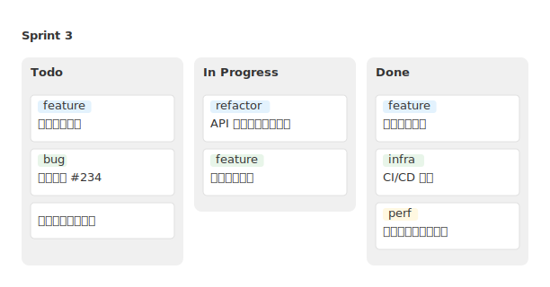

# mdd-kanban

カンバンボードプラグイン。Todo/In Progress/Done などの列にカードを配置する。

## 使い方

```
cat input.kanban | mdd-kanban > output.svg
```

## 入力形式

```
column Todo
card タスク名
card タスク名 : "ラベル"

column Done
card 完了タスク : "feature"
```

## サンプル


