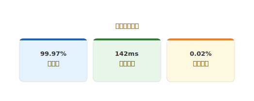

# mdd-kpi

`mdd` 用の KPI・メトリクスカードプラグイン。テキストベースの記法から SVG の KPI カード表示を生成する。

## 使い方

```bash
# 直接実行
cat input.kpi | mdd-kpi > output.svg

# mdd 経由
mdd input.md > output.md
```

## 記法

### メトリクス

```
metric "ラベル" : "値"
metric "ラベル" : "値" : "変化"
```

変化テキストが `+` で始まるか `up`・`増` を含む場合は緑色、`-` で始まるか `down`・`減` を含む場合は赤色で表示される。

## 描画

各メトリクスはカード形式で横並びに表示される。

| 要素 | 形状 | 説明 |
|---|---|---|
| カード | 角丸矩形 (rx=8) | 上部にカラーアクセントバー |
| 値 | 大文字 (24px) | 太字、`#333` |
| ラベル | 小文字 (12px) | `#666` |
| 変化 | 小文字 (12px) | 緑 (`#2e7d32`) or 赤 (`#c62828`) |

## サンプル

### ダッシュボード


### シンプル


