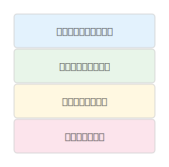
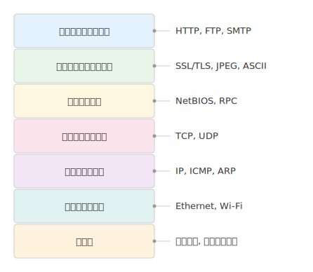

# mdd-layer

`mdd` 用の階層・レイヤー図プラグイン。テキストベースの記法から SVG の積層図を生成する。

## 使い方

```bash
# 直接実行
echo 'layer A
layer B
layer C' | mdd-layer > output.svg

# mdd 経由
mdd input.md > output.md
```

## 記法

### レイヤー定義

```
layer レイヤー名
layer レイヤー名 : "説明テキスト"
layer レイヤー名 color=#e0f7fa
layer レイヤー名 : "説明テキスト" color=#e0f7fa
```

レイヤーは上から順に積み重ねて描画される。色を省略すると自動的にパレットから割り当てられる。

説明を指定すると、ダイアグラムの右側に水平線で接続して表示される。

### グループ定義

```
group "グループ名" {
  layer レイヤー1
  layer レイヤー2
}
```

関連するレイヤーを破線枠でグループ化できる。

### コメント・空行

`#` で始まる行はコメントとして無視される。空行もスキップされる。

## 描画

| 要素 | 形状 | 背景色 |
|---|---|---|
| レイヤー | 角丸矩形 | パレットから自動割当（青→緑→黄→ピンク→紫→ティール→オレンジ→インディゴ） |
| グループ | 破線枠の角丸矩形 | 薄いグレー `#fafafa` |
| テキスト | — | `#333`（名前）、`#666`（説明） |

## サンプル

### シンプル



### OSI 参照モデル



### アーキテクチャレイヤー


