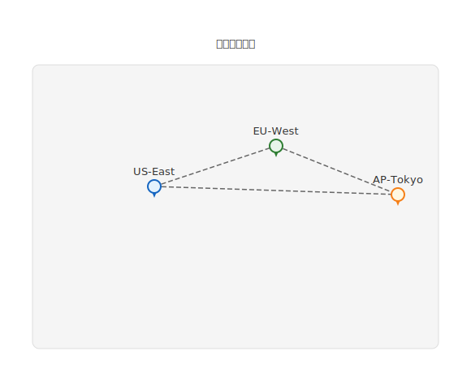

# mdd-map

`mdd` 用の地図・マッププラグイン。テキストベースの記法から SVG の地図・配置図を生成する。

## 使い方

```bash
# 直接実行
cat input.map | mdd-map > output.svg

# mdd 経由
mdd input.md > output.md
```

## 記法

### タイトル（省略可）

```
title "拠点マップ"
```

### キャンバスサイズ（省略可）

```
width 600
height 400
```

### ピン（1つ以上必須）

```
pin "ラベル" at x,y
```

### ルート（省略可）

ピン同士を破線で接続する。

```
route 0 -- 1
```

## 描画

| 要素 | 形状 | 色 |
|---|---|---|
| ピン | 円 + 三角（マーカー） | カラーパレット順 |
| ラベル | テキスト | `#333` |
| ルート | 破線 | `#666` |
| キャンバス | 角丸矩形 | `#f5f5f5` |

## サンプル

### オフィス拠点


### サーバー配置


