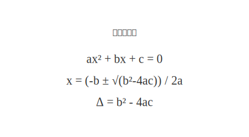

# mdd-math

`mdd` 用の数式表示プラグイン。テキストベースの記法から SVG の数式表示を生成する。

## 使い方

```bash
# 直接実行
cat input.math | mdd-math > output.svg

# mdd 経由
mdd input.md > output.md
```

## 記法

### タイトル（省略可）

```
title "物理学の基本公式"
```

### 数式

各行が 1 つの数式として表示される。`expr:` プレフィックスも使用可能。

```
E = mc²
F = ma
```

または

```
expr: E = mc²
expr: F = ma
```

Unicode の数学記号（上付き文字 ²、ギリシャ文字 α, β など）はそのまま表示される。

## 描画

| 要素 | フォント | サイズ | テキスト色 |
|---|---|---|---|
| タイトル | sans-serif | 16px | `#333` |
| 数式 | Times New Roman, serif | 20px | `#333` |

## サンプル

### 物理学の基本公式


### 二次方程式


