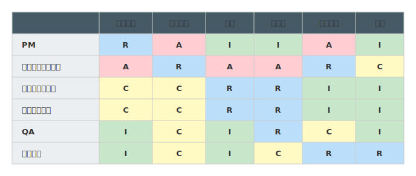
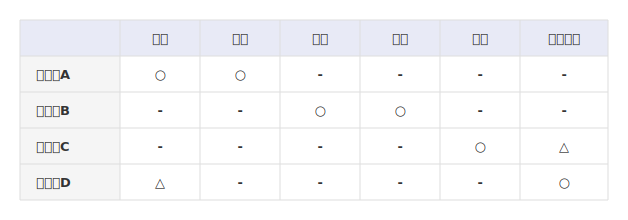
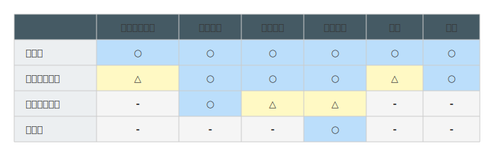

# mdd-matrix

`mdd` 用のマトリクス図プラグイン。テキストベースの記法から色付きマトリクス表を SVG で生成する。

## 使い方

標準入力からマトリクス記法を受け取り、標準出力に SVG を出力する。

```sh
mdd-matrix < examples/raci.matrix > output.svg
```

`mdd` 経由で使う場合は、Markdown のコードブロックに `matrix` を指定する。

````md
```matrix
columns 設計, 実装, テスト

田中 : R, A, C
佐藤 : A, R, R
```
````

## 記法

### columns

列ヘッダーをカンマ区切りで定義する。

```
columns 要件定義, 基本設計, 実装, テスト
```

### color

セル値に対する文字色（と任意で背景色）を定義する。全ての色は DSL 上で宣言的に指定する。

```
color R : blue
color A : red
color C : amber
color I : green
color ○ : blue
color △ : amber
color - : lightgrey
```

背景色も指定する場合:

```
color OK : green, #e8f5e9
```

使える色名: `red`, `blue`, `green`, `amber`, `yellow`, `orange`, `teal`, `purple`, `pink`, `grey`, `lightgrey`, `black`。`#ff0000` のような HEX コードも直接指定可能。

### row

行ラベルとセル値をカンマ区切りで定義する。

```
PM : R, A, I, I
エンジニア : C, R, R, A
```

## サンプル

### RACI マトリクス



### 機能×チーム対応表



### 権限マトリクス


