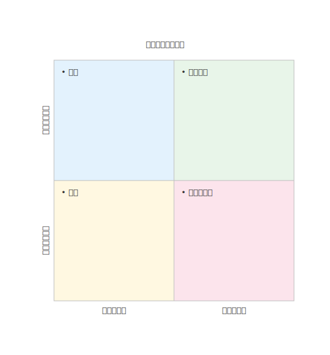

# mdd-matrix

`mdd` 用のマトリクス図プラグイン。テキストベースの記法から SVG の 2x2 マトリクス図を生成する。

## 使い方

```bash
# 直接実行
cat input.matrix | mdd-matrix > output.svg

# mdd 経由
mdd input.md > output.md
```

## 記法

### 軸ラベル（省略可）

```
x-axis "緊急でない" "緊急"
y-axis "重要でない" "重要"
```

### 象限

象限番号は 1=左上、2=右上、3=左下、4=右下。

```
quadrant 1 : "計画" "戦略立案"
quadrant 2 : "即実行" "危機対応"
quadrant 3 : "削除" "時間の浪費"
quadrant 4 : "委任" "割り込み作業"
```

## 描画

| 要素 | 背景色 |
|---|---|
| 象限 1（左上） | `#e3f2fd`（薄い青） |
| 象限 2（右上） | `#e8f5e9`（薄い緑） |
| 象限 3（左下） | `#fff8e1`（薄い黄） |
| 象限 4（右下） | `#fce4ec`（薄いピンク） |

## サンプル

### アイゼンハワー・マトリクス


### リスクマトリクス


