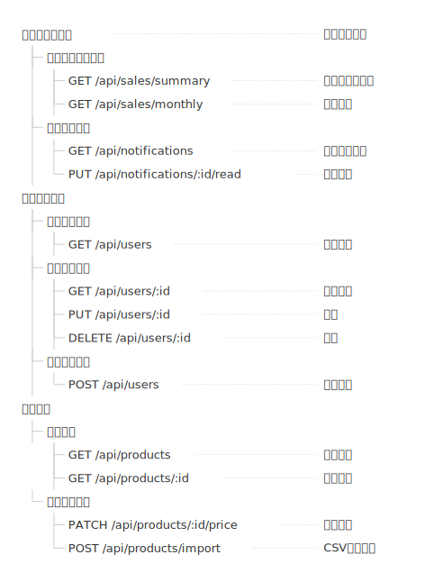

# mdd-outline

`mdd` 用のアウトラインプラグイン。インデントベースの階層構造をツリー罫線付きで SVG に生成する。

## 使い方

```bash
# 直接実行
printf 'A\n  B\n  C' | mdd-outline > out.svg

# mdd 経由
mdd input.md > output.md
```

## 記法

インデント（2スペース）で親子関係。説明は ` : "..."` で追加。

```
ダッシュボード : "トップページ"
  売上サマリー
    GET /api/sales/summary : "日次集計"
  お知らせ
    GET /api/notifications
```

深さ制限なし。どんな階層構造でも使える。

## サンプル

### 最小例


### アプリ構造


