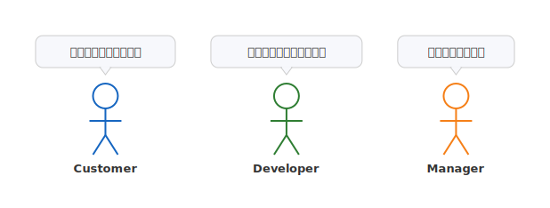

# mdd-persona

ペルソナ・アクター図プラグイン。棒人間のアクターとラベル、吹き出しでユーザーの声やステークホルダーの意見を可視化する。

## 使い方

```
cat input.persona | mdd-persona > output.svg
```

## 入力形式

```
title "タイトル"
actor 名前
actor 名前 : ラベル
actor 名前 : "吹き出しテキスト"
actor 名前 : ラベル : "吹き出しテキスト"
```

### 複数行の吹き出し

開き `"` から閉じ `"` までが吹き出しになります。

```
actor 田中 : PM : "もっと早くリリースしたい
品質も落としたくない"
```

## サンプル

### シンプル



### チームの声


