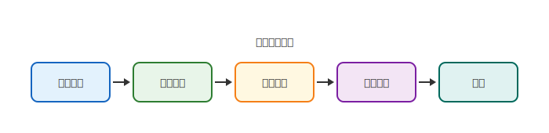

# mdd-process

`mdd` 用のプロセスフロー図プラグイン。テキストベースの記法から SVG の横型プロセスフロー図を生成する。

## 使い方

```bash
# 直接実行
cat input.process | mdd-process > output.svg

# mdd 経由
mdd input.md > output.md
```

## 記法

### ステップ

```
書類選考
一次面接
二次面接
最終面接
内定
```

各ステップが横並びの角丸矩形として描画され、矢印で左から右へ接続される。最低 2 ステップが必要。

### 説明付き

各ステップに説明を追加できます。説明はカードの下に表示されます。

```
企画 { 要件定義 }
設計 { アーキテクチャ }
```

説明は複数行にも対応しています。`{` から `}` までが説明になります。

```
企画 {
  要件定義
  スコープ決定
}
設計 {
  アーキテクチャ
  DB設計
}
```

## 描画

| 要素 | 形状 | 説明 |
|---|---|---|
| ステップ | 角丸矩形 (`rx="8"`) | パステルカラーが順番に適用される |
| 矢印 | 実線 + 三角 | ステップ間を接続 |
| テキスト | — | `#333` |

## サンプル

### シンプル


### 採用プロセス


