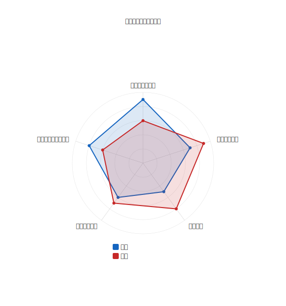

# mdd-radar

レーダーチャートプラグイン。多軸のスキルや特性を比較する。

## 使い方

```
cat input.radar | mdd-radar > output.svg
```

## 入力形式

```
axis フロントエンド
axis バックエンド
axis インフラ
data "田中" : 90, 70, 50
data "鈴木" : 60, 90, 80
```

値は 0〜100。

## サンプル


