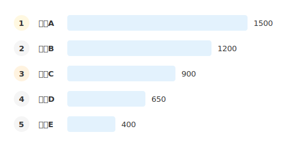
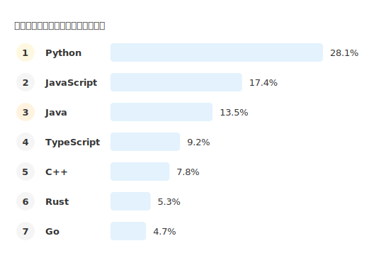

# mdd-ranking

`mdd` 用のランキング図プラグイン。テキストベースの記法から SVG のランキング図を生成する。

## 使い方

```bash
# 直接実行
cat input.ranking | mdd-ranking > output.svg

# mdd 経由
mdd input.md > output.md
```

## 記法

### 単位（オプション）

```
unit "万円"
```

### 項目

```
項目名 : 値
```

記述順がそのまま順位になる（上から1位、2位、...）。

## 描画

| 要素 | 形状 | 色 |
|---|---|---|
| 1位バッジ | 丸 | 背景 `#fff8e1`（薄い黄）、文字 `#f57f17`（ゴールド） |
| 2位バッジ | 丸 | 背景 `#f5f5f5`（薄いグレー）、文字 `#757575`（シルバー） |
| 3位バッジ | 丸 | 背景 `#fff3e0`（薄いオレンジ）、文字 `#e65100`（ブロンズ） |
| 4位以下バッジ | 丸 | 背景 `#f5f5f5`、文字 `#999` |
| バー | 角丸矩形 | `#e3f2fd`（薄い青） |
| 値テキスト | — | `#1565c0`（青） |

## サンプル

### シンプル



### 売上ランキング


### プログラミング言語人気ランキング


