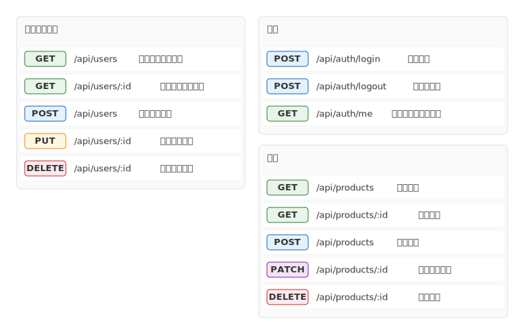

# mdd-restapi

`mdd` 用の REST API 一覧プラグイン。テキストベースの記法から SVG の API リファレンスを生成する。

## 使い方

```bash
# 直接実行
echo 'GET /api/users : "ユーザー一覧"' | mdd-restapi > out.svg

# mdd 経由
mdd input.md > output.md
```

## 記法

### エンドポイント定義

```
GET    /api/users          : "ユーザー一覧取得"
POST   /api/users          : "ユーザー作成"
PUT    /api/users/:id      : "ユーザー更新"
DELETE /api/users/:id      : "ユーザー削除"
PATCH  /api/users/:id      : "ユーザー部分更新"
```

説明は省略可能:

```
GET /api/health
```

### グループ

```
group "リソース名" {
  GET  /path : "説明"
  POST /path : "説明"
}
```

## 描画

| 要素 | 形状 | 色 |
|---|---|---|
| GET | バッジ | 緑系 (`#e8f5e9` / `#2e7d32`) |
| POST | バッジ | 青系 (`#e3f2fd` / `#1565c0`) |
| PUT | バッジ | 橙系 (`#fff8e1` / `#f57f17`) |
| DELETE | バッジ | 赤系 (`#ffebee` / `#c62828`) |
| PATCH | バッジ | 紫系 (`#f3e5f5` / `#7b1fa2`) |
| パス | モノスペースフォント | `#333` |
| 説明 | 通常フォント | `#666` |
| グループ | ヘッダー付きセクション | `#fafafa` |

## サンプル

### 最小例


### CRUD API


