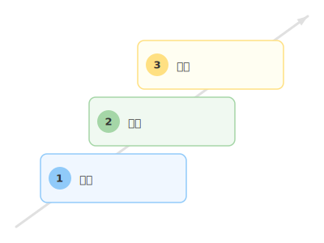
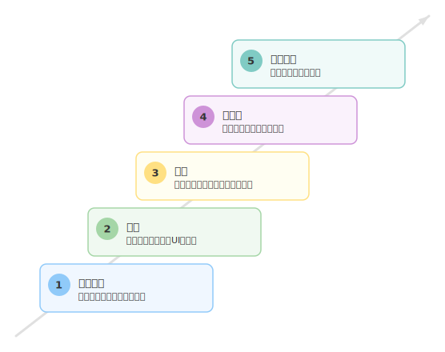

# mdd-roadmap

`mdd` 用のロードマッププラグイン。テキストベースの記法から SVG のロードマップ図を生成する。

## 使い方

```bash
# 直接実行
echo 'milestone 計画\nmilestone 実行\nmilestone 評価' | mdd-roadmap > output.svg

# mdd 経由
mdd input.md > output.md
```

## 記法

### マイルストーン定義

```
milestone {タイトル}
milestone {タイトル} : "{説明}"
```

- 各行が1つのマイルストーンを定義する
- 定義順に階段状（左下→右上）に配置される
- 背景に右肩上がりの矢印が描画され、成長・進捗のニュアンスを伝える
- 説明はオプション。ダブルクォートで囲む

## 描画

| 要素 | 形状 | 色 |
|---|---|---|
| マイルストーン | 角丸矩形 | パステルカラー（マイルストーンごとに変化） |
| 番号バッジ | 円 | 各マイルストーンの強調色 |
| 背景矢印 | 直線＋矢じり | 薄いグレー |
| テキスト | — | `#333`（濃い文字） |

## サンプル

### シンプル（simple.roadmap）



### ソフトウェア開発ライフサイクル（sdlc.roadmap）



### スキル成長（growth.roadmap）


