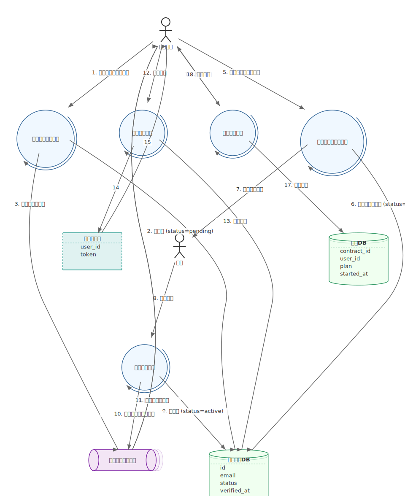

# mdd-scenario

`mdd` 用のシステムシナリオプラグイン。mdd-system と同じ DSL で、上から下への流れ（Sugiyama レイアウト）でシナリオを可視化する。

## 使い方

```bash
cat input.scenario | mdd-scenario > out.svg
```

## mdd-system との違い

| | mdd-system | mdd-scenario |
|---|---|---|
| 目的 | 静的な構成図 | 時系列のシナリオ |
| レイアウト | Sugiyama (汎用) | Sugiyama (上→下フロー) |
| 使い分け | 「何が何に繋がるか」 | 「どう流れるか」 |

DSL は完全に同じ。ノード種別・エッジ・インラインdata・グループすべて共通。

## サンプル

### ログインシナリオ


