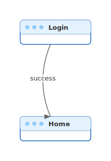
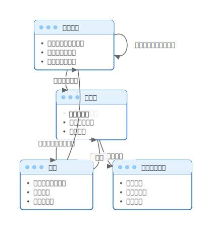

# mdd-screen-flow

`mdd` 用の画面遷移図プラグイン。テキストベースの記法から SVG の画面遷移図を生成する。

## 使い方

```bash
# 直接実行
echo 'screen Login
screen Home
Login -> Home : "success"' | mdd-screen-flow > out.svg

# mdd 経由
mdd input.md > output.md
```

## 記法

### 画面定義

```
screen 画面名
```

UI要素付きの画面:

```
screen 画面名 {
  要素1
  要素2
}
```

### 遷移定義

```
画面A -> 画面B : "アクション"
画面A -> 画面B
```

### グループ

```
group "セクション名" {
  screen 画面A
  screen 画面B
}
```

## 描画

| 要素 | 形状 | 色 |
|---|---|---|
| 画面 | ブラウザウィンドウ風カード | 青系（`#e3f2fd` / `#1565c0`） |
| UI要素 | カード内の箇条書き | グレー（`#555`） |
| 遷移 | 矢印 + ラベル | グレー（`#666`） |
| グループ | 破線矩形 | 紫系（`#f3e5f5` / `#7b1fa2`） |

## サンプル

### 最小例



### アプリ画面遷移


