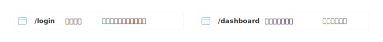
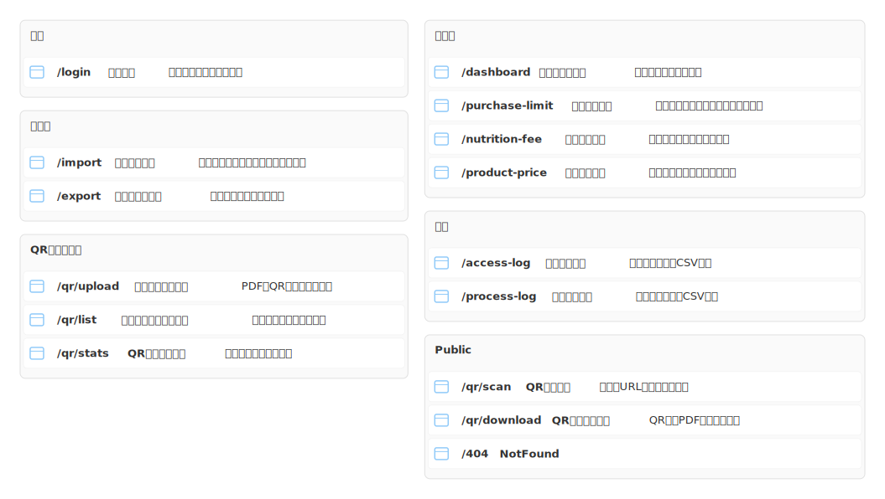

# mdd-screens

`mdd` 用の画面一覧プラグイン。URLパス・画面名・説明をリスト形式で SVG に生成する。

## 使い方

```bash
# 直接実行
echo '/login ログイン : "メール認証"' | mdd-screens > out.svg

# mdd 経由
mdd input.md > output.md
```

## 記法

### 画面定義

```
/path 画面名 : "説明"
/path 画面名
/path
```

### グループ

```
group "セクション名" {
  /path 画面名 : "説明"
}
```

## サンプル

### 最小例



### アプリ画面一覧


