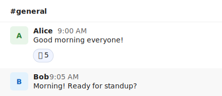

# mdd-slack

Slack 風メッセージプラグイン。Slack のチャット画面風にメッセージを SVG 描画する。

## 使い方

```
cat input.slack | mdd-slack > output.svg
```

## 入力形式

```
channel #チャンネル名
msg "名前" : "メッセージ本文"
time "10:30 AM"
react :emoji: 数
thread 返信数
```

`channel`、`time`、`react`、`thread` は省略可能。

### 複数行のメッセージ

開き `"` から閉じ `"` までがメッセージ本文になります。

```
msg "田中" : "デプロイ完了しました。
確認お願いします。"
time "10:30 AM"
react :+1: 4
```

### 複数メッセージ

```
msg "Alice" : "Hello!"
time "9:00 AM"

msg "Bob" : "Hi there!"
time "9:05 AM"
```

## サンプル

### シンプル



### 会話


