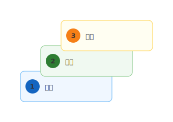

# mdd-steps

`mdd` 用のステップ図プラグイン。テキストベースの記法から SVG の階段・ステップ図を生成する。

## 使い方

```bash
# 直接実行
echo 'step 計画\nstep 実行\nstep 評価' | mdd-steps > output.svg

# mdd 経由
mdd input.md > output.md
```

## 記法

### ステップ定義

```
step {タイトル}
step {タイトル} : "{説明}"
```

- 各行が1つのステップを定義する
- 定義順に階段状（左下→右上）に配置される
- 説明はオプション。ダブルクォートで囲む

## 描画

| 要素 | 形状 | 色 |
|---|---|---|
| ステップ | 角丸矩形 | パステルカラー（ステップごとに変化） |
| 番号バッジ | 円 | 各ステップの強調色 |
| コネクタ | 破線 | グレー |
| テキスト | — | `#333`（濃い文字） |

## サンプル

### シンプル（simple.steps）



### ソフトウェア開発ライフサイクル（sdlc.steps）


### スキル成長（growth.steps）


