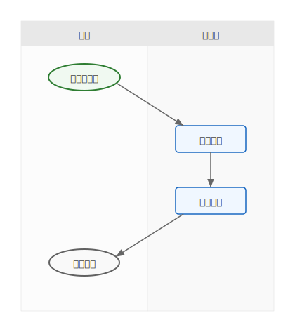
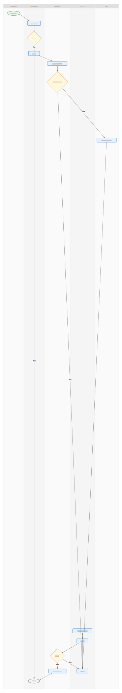

# mdd-swimlane

`mdd` 用のスイムレーン図（業務フロー図）プラグイン。テキストベースの記法からスイムレーン付きフローチャートを SVG で生成する。

## 使い方

標準入力からスイムレーン記法を受け取り、標準出力に SVG を出力する。

```sh
mdd-swimlane < examples/simple.swimlane > output.svg
```

`mdd` 経由で使う場合は、Markdown のコードブロックに `swimlane` を指定する。

````md
```swimlane
lane 顧客
lane 営業部

顧客: start 問い合わせ
営業部: process 対応
顧客: end 完了

問い合わせ -> 対応
対応 -> 完了
```
````

## 記法

### lane

レーン（担当者/部門/システム）を定義する。定義順に左から右に並ぶ。

```
lane 顧客
lane 営業部
lane システム
```

### node

ノードをレーンに配置する。`<レーン名>: <種類> <名前>` の形式。

```
顧客: start 問い合わせ
営業部: process 受付対応
営業部: decision 見積必要？
顧客: end 完了
```

| 種類 | 形状 | 色 |
|---|---|---|
| start | 角丸楕円 | 薄い緑 |
| end | 角丸楕円 | 薄いグレー |
| process | 矩形 | 薄い青 |
| decision | ひし形 | 薄い黄 |

### edge

ノード間のフロー（有向エッジ）。レーンをまたぐエッジも可。

```
問い合わせ -> 受付対応
見積必要？ -> 見積作成 : "Yes"
見積必要？ -> 見積提示 : "No"
```

## サンプル

### シンプルな業務フロー



### 受注プロセス（4レーン）


### インシデント対応（5レーン）


