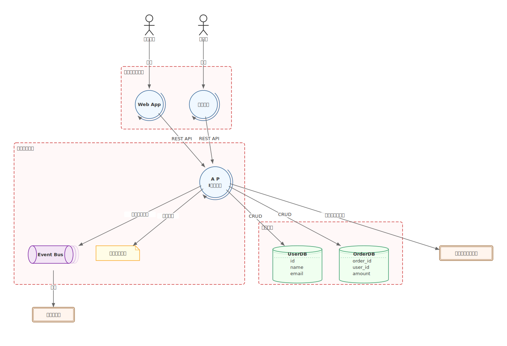

# mdd-system

`mdd` 用のシステム図プラグイン。プロセス、データストア、キュー、ファイル等のシステム構成要素を型付きノードとして描画する。

## 使い方

```bash
cat input.system | mdd-system > out.svg
```

## ノード種別

| キーワード | 形状 | 用途 |
|---|---|---|
| `process` | 円形 + 循環矢印 | サービス、処理 |
| `entity` | 二重枠矩形 | 外部システム |
| `datastore` | 縦シリンダー | データベース（列定義可） |
| `actor` | 棒人間 | ユーザー、ロール |
| `file` | ドッグイヤー矩形 | ファイル、ドキュメント（列定義可） |
| `queue` | 横シリンダー | メッセージキュー |
| `cache` | 破線シリンダー | 一時データ（列定義可） |

## サンプル


