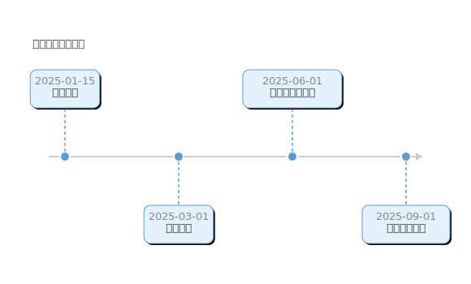
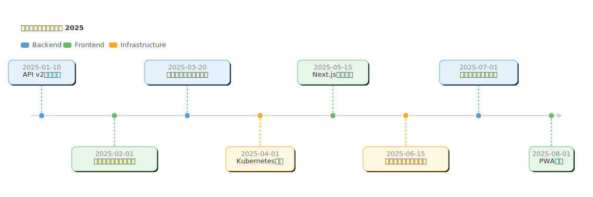

# mdd-timeline

`mdd` 用のタイムラインプラグイン。テキストベースの記法から SVG のタイムラインを生成する。

## 使い方

```bash
# 直接実行
echo '2025-01-01 : リリース' | mdd-timeline > output.svg

# mdd 経由
mdd input.md > output.md
```

## 記法

### タイトル

```
title プロジェクト概要
```

### イベント

```
YYYY-MM-DD : イベント名
```

日付とラベルを `:` で区切る。ラベルはダブルクォートで囲んでもよい。

### セクション

```
section 創業期
2018-04-01 : 会社設立
2019-03-01 : 初の顧客獲得

section 成長期
2020-01-15 : シリーズA調達
```

セクションごとに色分けされ、凡例が表示される。

## 描画

| 要素 | 形状 | 色 |
|---|---|---|
| イベント | 角丸矩形 | セクション色（薄い背景 + 濃い枠） |
| ドット | 円 | セクション色 |
| 接続線 | 破線 | セクション色 |
| 軸 | 水平線 + 矢印 | `#ccc` |
| テキスト | — | `#333` |
| 日付 | — | `#888` |

イベントは軸の上下に交互に配置される。

## サンプル

### シンプル



### 会社沿革


### リリースロードマップ


