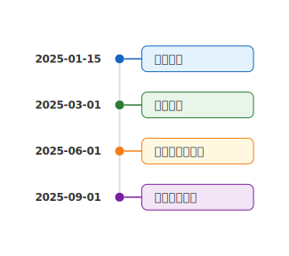

# mdd-timetable

`mdd` 用のタイムテーブルプラグイン。「いつ・何が」のシンプルなスケジュールを縦型タイムラインの SVG として生成する。

## 使い方

```bash
# 直接実行
echo '09:00 朝会\n10:00 開発' | mdd-timetable > output.svg

# mdd 経由
mdd input.md > output.md
```

## 記法

```
<いつ> <イベント名>
```

- 各行が1つのエントリ
- 最初のスペースで「いつ」と「何が」を分割
- 「いつ」の形式は自由（`HH:MM`、`YYYY-MM-DD`、任意のテキスト）
- 入力順をそのまま表示（ソートしない）
- 空行はスキップ

## サンプル

### 1日のスケジュール（daily.timetable）


### プロジェクトマイルストーン（project.timetable）


