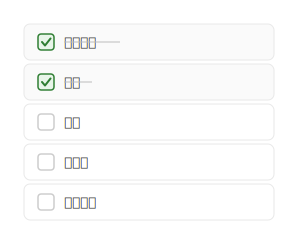

# mdd-todo

TODO リストプラグイン。チェックボックス付きのタスクリストを SVG で描画する。

## 使い方

```
cat input.todo | mdd-todo > output.svg
```

## 入力形式

```
title "タイトル"
[x] 完了タスク
[ ] 未完了タスク
```

`[x]` は完了（チェック済み・取り消し線付き）、`[ ]` は未完了。

### 説明付き

各タスクに説明を追加できます。説明はタスク名の下に表示されます。

```
[x] ユーザー認証 : "JWT対応"
[ ] パスワードリセット : "メール送信機能"
```

説明は複数行にも対応しています。開き `"` から閉じ `"` までが説明になります。

```
[ ] パスワードリセット : "メール送信機能
トークン有効期限管理"
```

## サンプル

### シンプル



### スプリントタスク


