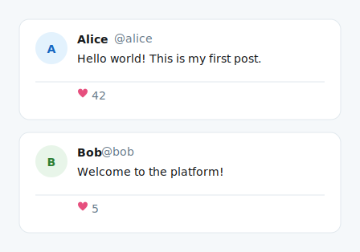

# mdd-tweet

ツイート風投稿プラグイン。Twitter/X 風のカード形式で投稿を SVG 描画する。

## 使い方

```
cat input.tweet | mdd-tweet > output.svg
```

## 入力形式

```
post "名前" @ハンドル : "投稿内容"
likes いいね数
retweets リツイート数
time "日時"
```

`likes`、`retweets`、`time` は省略可能。

### 複数行の投稿

開き `"` から閉じ `"` までが投稿本文になります。

```
post "田中太郎" @tanaka : "Rust で CLI を作った。
パフォーマンスが良い。
型安全で安心。"
likes 128
retweets 34
time "2025-06-07 10:30"
```

### 複数投稿

```
post "Alice" @alice : "Hello!"
likes 42

post "Bob" @bob : "Welcome!"
likes 5
```

## サンプル

### シンプル



### スレッド


