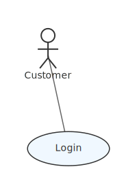
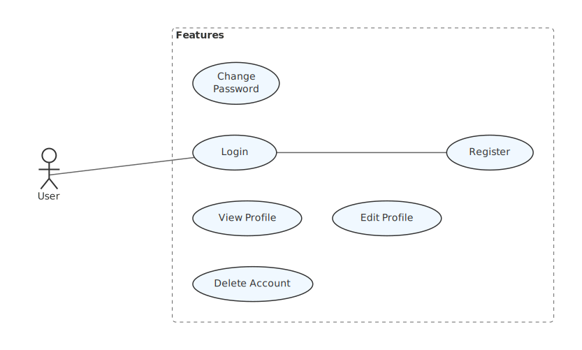

# mdd-usecase

`mdd` 用のユースケース図プラグイン。テキストベースの記法からSVGのユースケース図を生成する。

## 使い方

標準入力からユースケース記法を受け取り、標準出力にSVGを出力する。

```sh
mdd-usecase < examples/simple.usecase > output.svg
```

`mdd` 経由で使う場合は、Markdownのコードブロックに `usecase` を指定する。

````md
```usecase
actor Customer
usecase Login
Customer -> Login
```
````

## 記法

### actor

アクター（棒人間）を定義する。

```
actor Customer
```

### usecase

ユースケース（楕円）を定義する。

```
usecase Login
```

### package

ユースケースをグループ化するパッケージ（破線の矩形）を定義する。

```
package "Authentication" {
  usecase Login
  usecase Logout
}
```

### edge

アクターやユースケース間の関連を `->` で定義する。

```
Customer -> Login
Login -> TwoFactorAuth
```

## レイアウト

レイアウトエンジンは以下の仕組みで図を整形する。

- **適応的スペーシング** -- 図の複雑度（ノード数 + エッジ数）に応じてスペーシングが自動的にスケーリングされる。シンプルな図はコンパクトに、複雑な図はゆとりを持って描画される。
- **nodesep / ranksep** -- ランク内（同じ階層のノード間）とランク間（異なる階層間）のスペーシングを独立して制御する。内部的には [rust-sugiyama](https://crates.io/crates/rust-sugiyama) のレイアウト後にポストスケーリングを行い、軸ごとに異なる間隔を実現する。
- **Row-based パッキング** -- パッケージ内の非接続コンポーネント（エッジで繋がっていないノード群）を行ベースの棚パッキングで配置する。面積合計から最適な行幅を算出し、横幅を超えたら次の行へ折り返す。

## サンプル

### シンプルな図



### 複雑な図（複数アクター、複数パッケージ）


### 非接続ノードを含む図


