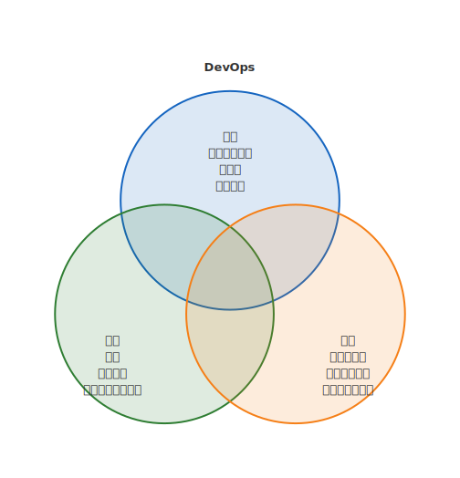

# mdd-venn

`mdd` 用のベン図プラグイン。テキストベースの記法から SVG のベン図を生成する。

## 使い方

```bash
# 直接実行
cat input.venn | mdd-venn > output.svg

# mdd 経由
mdd input.md > output.md
```

## 記法

### タイトル（省略可）

```
title "エンジニアスキル"
```

### セット定義

```
set "フロントエンド" {
  HTML/CSS
  React
  UI設計
}
```

### 重なり定義

```
overlap "共通" {
  TypeScript
  テスト
}
```

2つまたは3つのセットに対応。2セットの場合は2つの重なる円、3セットの場合は三角形配置の3つの重なる円で描画される。

## 描画

| 要素 | 形状 | 色 |
|---|---|---|
| セット1 | 円（半透明） | `#1565c0`（青） |
| セット2 | 円（半透明） | `#2e7d32`（緑） |
| セット3 | 円（半透明） | `#f57f17`（黄） |
| テキスト | — | `#333` |

## サンプル

### エンジニアスキル


### DevOps


