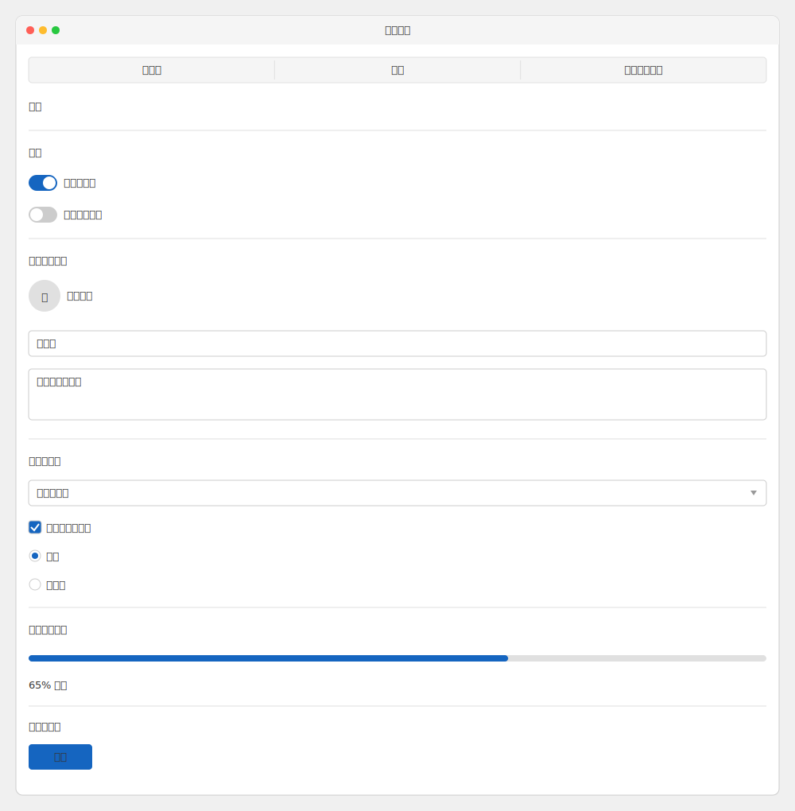

# mdd-wireframe

ワイヤーフレームプラグイン。シンプルなUI モックアップを生成する。

## 使い方

```
cat input.wireframe | mdd-wireframe > output.svg
```

## 入力形式

```
title "ページ名"
header 見出し
subheader サブ見出し
text "説明文"
link "リンクテキスト"
input "プレースホルダー"
textarea "複数行入力"
select "選択してください"
button ボタン名
checkbox "ラベル"
checkbox checked "チェック済み"
radio "選択肢"
radio selected "選択済み"
toggle "ラベル"
toggle on "ON状態"
image "画像の説明"
avatar "ユーザー名"
progress 75
nav タブ1 | タブ2 | タブ3
---
- リスト項目1
- リスト項目2
```

## サンプル



